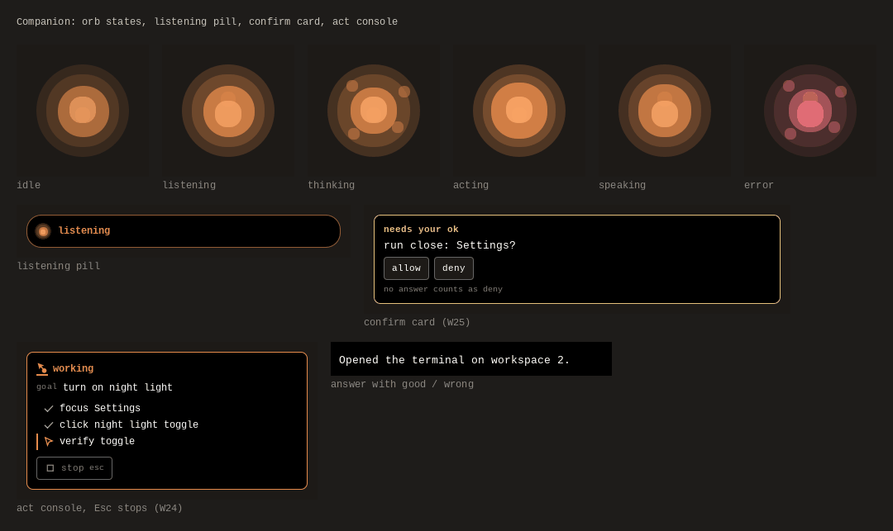
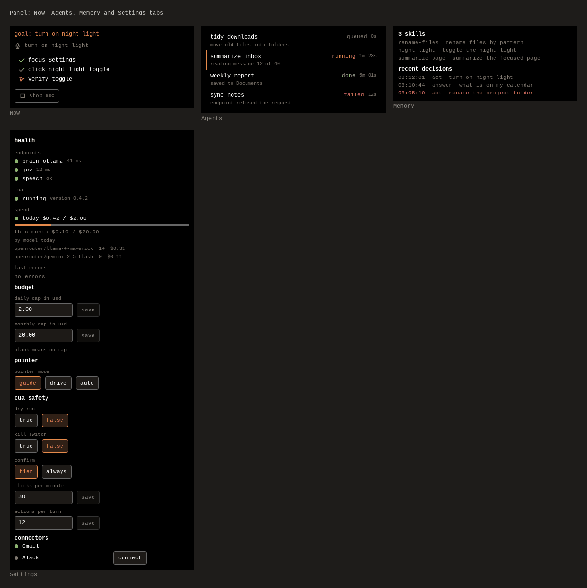
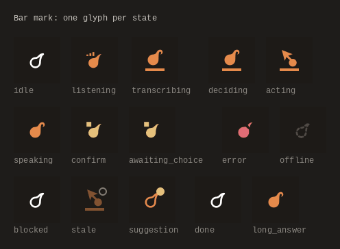
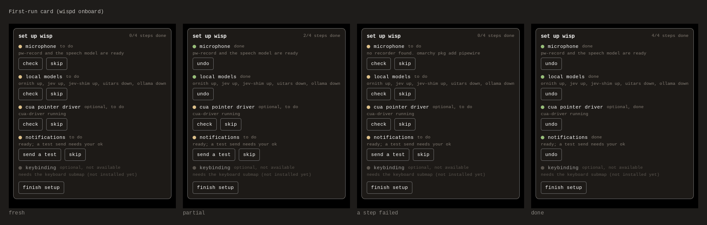
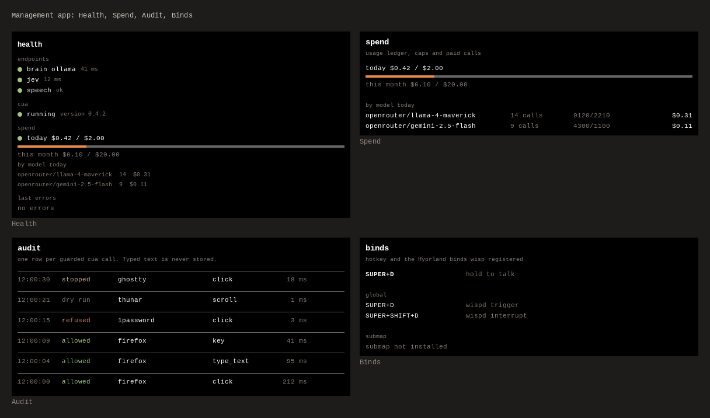

# Wisp

Wisp is a resident voice companion for Omarchy (Hyprland). Hold `Super+D`,
speak, and Wisp hears you, decides what you meant, and acts: it answers
with your screen as context, drives the desktop one step at a time, points
at the thing it means, or hands a long job to a background coding agent.
It keeps the conversation open across utterances, so "check the build",
"open it" and "scroll to the failure" are one task.

Pipeline: push-to-talk, PipeWire capture, whisper.cpp, Jev routing, then
one of launch, tool, agent, act, dictate, answer or clarify. The result
shows up as an orb, a cursor bubble, a listening pill and a panel.

Status: v0.9 shipped; v1.0 is a verification milestone (a labelled soak,
a fresh-box install and the learning loop; see `ROADMAP.md`). Linux
(Omarchy/Hyprland) is the primary platform. macOS is supported through
the platform layer (`docs/MACOS.md`). Windows is scaffolded, not
supported.

## What it looks like

These images are real renders. They are composed from the offscreen
snapshot goldens in `tests/qml/snapshots` (the shipped QML components run
through the real state reducer, with no compositor and no mock-ups) by
`scripts/ui/readme_media.py`. Live screen recordings are still to do; see
[Media](#media).











## Install

```sh
git clone https://github.com/duketopceo/wisp
cd wisp
python3 wispd install          # files, shell plugin, unit, desktop entry, bind
systemctl --user enable --now wispd
wispd onboard                  # guided first run, every step skippable
```

- `wispd install --units` installs only the systemd units for the local
  model services and the daemon (oomd-safe, see `docs/LINUX.md`). Add
  `--dry-run` to preview. It never enables or starts anything.
- `wispd install --cua` installs the pinned `cua-driver` (checksum
  verified, user scope, no sudo). `--dry-run` previews it.
- `wispd onboard` checks the microphone, the local models, the cua driver,
  notifications and the keyboard submap. The Panel shows the same
  checklist as a card until you finish. Nothing in it edits your config.
- `wispd doctor` checks every dependency and prints the fix for each
  missing one.

Prerequisites: `pw-record` (or `arecord`), whisper.cpp at
`~/src/whisper.cpp` with `models/ggml-small.en.bin`, `hyprctl`,
`notify-send`. Optional: `grim`, `wtype`, `espeak-ng`, `ori` (agent
spawning). Secrets go in `~/.config/wisp/.env` (`OPENROUTER_API_KEY=...`)
or an `omaseal` reference; nothing is committed. Full steps and per-OS
notes are in `docs/INSTALL.md`; every config key is in `docs/CONFIG.md`.

## Surfaces

- **Companion**: a small orb in the corner of the screen with a mode
  badge and goal line. While you speak, a bottom-center pill shows
  `listening`. Answers appear in a bubble next to your cursor and stream
  in as they are written, with `good` and `wrong` buttons that label the
  run. While Wisp acts, a console lists the steps and a stop control.
  A ghost cursor shows where Wisp is about to click without moving your
  real pointer.
- **Panel**: opened from the bar. Four tabs: Now (the current turn and
  steps), Agents (background tasks), Memory (skills and recent
  decisions) and Settings (health, spend caps, pointer and cua safety,
  connectors). A first-run card sits on top until setup is finished.
- **Bar mark**: one glyph in the Omarchy bar that shows the state at a
  glance (idle, listening, working, needs your ok, error, offline).
- **Desktop entry**: "Wisp" in the app menu, with Listen, Stop and Panel
  actions. No tray icon is shipped (see `docs/INSTALL.md`).
- **Management app and TUI**: Health, Spend, Audit and Binds views over
  the same data. `wispd tui` is the terminal version.

Every surface reads one state stream from the daemon
(`docs/IPC_CONTRACT.md`), so they never disagree.

## Using it

| Keys | What happens |
|---|---|
| `Super+D` (hold) | listen; release to send. `wispd trigger` toggles instead |
| `Esc` while Wisp acts or waits | stop the turn |
| `Enter` on a confirm card | pick option 1 (the yes) |
| `1` to `9` on a choice | pick that option |

The `Esc`, `Enter` and number keys exist only while a turn is acting or
waiting, through a Hyprland submap named `wisp`, so they never shadow
typing. `[keys] submap = "false"` turns the submap off. Nothing is written
to your Hyprland config.

What a turn can do:

- **Answer**: with the screenshot taken when you pressed the key, so it
  already knows the focused app. `[POINT]` replies move the ghost cursor.
  Set `[agent] screenshots = "false"` to keep images local.
- **Act**: a bounded loop that re-screenshots before every pointer action.
  No blind clicks. See [Computer use](#computer-use).
- **Agent**: "Wisp, agent, fix the tests in wisp" starts a named task on
  your runtime (`opencode`, `codex`, `claude` or `devin`; `auto` probes
  `PATH`). `wispd task list` shows status and a live log tail.
- **Tools**: launch, focus and close apps, switch workspace, notify,
  screenshot, pointer, typing, a guarded shell, file search, and
  `mcp_call` to any configured MCP server. `wispd connect <service>`
  connects OAuth services through the local BrowserOS gateway.
- **Goal memory**: utterances that share the focused app or the running
  goal join one goal (`[agent] goal_ttl_s`, 10 minutes). Questions from
  the agent come back through the voice backchannel without ending it.

## Computer use

Wisp can click, scroll, type and press keys for you. Pointer backends,
in auto order: `cua` (background virtual pointer, no focus steal),
`hyprcursor`, `ydotool`, `wlrctl`, then `guide`, where Wisp only shows
the target and you click. `[pointer] mode` is `guide` by default (safe),
`drive` to inject input, or `auto`.

Safety is on by default and sits between the act loop and the backend:

- a kill switch (`wispd cua kill`, `wispd cua resume`) that refuses all
  input at once, and a dry run mode that plans and logs without acting;
- a built-in deny list (password managers, polkit and pinentry prompts,
  keyrings, terminals showing `sudo`) plus your own `[cua] deny` and
  `[cua] allow` lists;
- rate caps per minute and per turn, and a confirm card for risky steps
  (one yes covers a tool in one app for the session);
- an audit line for every call in `~/.local/state/wisp/cua.jsonl`. Typed
  text, target names and screenshots are never written.

Targets are grounded from names to screen points through a chain: the
window's accessibility tree, then local UI-TARS, then the vision
fallback. A low-confidence point is re-observed once and then refused,
never clicked. How all of this fits together, with config keys and
troubleshooting, is in [`docs/CUA.md`](docs/CUA.md).

## Spend

Paid-model spend is recorded in one ledger (`wispd spend`). Caps are USD
and reset by local date:

- `[budget] daily_usd` (default 8.00) and `[budget] monthly_usd`
  (default 160.00). `[brain] daily_cap_usd` still works as an alias for
  the daily cap.
- At a cap, paid fallback models stop. The primary brain keeps running so
  Wisp does not go dumb mid-task, unless `[budget] gate_primary = "true"`,
  which stops the primary too.
- Local models are recorded at zero cost and never gated.
- Offline batch jobs (`wispd batch`) use cheap models and count against
  the same caps.

## Local models

Wisp runs on local OpenAI-compatible servers when you want zero marginal
cost. Any `llama.cpp`, Ollama or LM Studio endpoint works as a
`[brain.<name>]` provider.

| Endpoint | Port | Role |
|---|---|---|
| Ornith (llama-server, GPU) | `:8080` | answer and act brain |
| Jev (llama-jev) behind jev-shim | `:8091`, `:8931` | decisions router |
| UI-TARS-7B (llama-server) | `:8081` | GUI grounding, emits `Action: click(x,y)` text |
| Ollama | `:11434` | CPU or GPU brain, native `/api/chat` |

`wispd health` probes these over loopback only. `wispd health start`
prints the command that starts a down endpoint (`--run` executes it).
Jev is an accelerator, not a gate: past `[jev] deadline_ms` a heuristic
router decides and the turn goes on. Provider sections and flags are in
`docs/CONFIG.md`.

## Learning

Every run can be labelled (`wispd label set correct|incorrect`, or the
`good` and `wrong` buttons). Labels measure routing accuracy
(`wispd label report`). A verified multi-step run becomes a `recipe-*`
skill proposal; `wispd recipes approve <name>` installs it. The weekly
`wispd learn weekly` stages a criteria proposal from your corrections.
Everything is staged for you to approve; nothing installs itself.

## Privacy

- Audio is transcribed locally by default (`[stt] provider = "local"`).
- Screenshots ride into the model only for the turn that needs them, and
  stay on the machine when `screenshots = "false"` or the brain is local.
- Error reporting is off. If you set `[report] dsn` (a GlitchTip DSN or
  an `omaseal://` reference), only typed error codes and a scrubbed
  context are sent: never transcripts, screenshots, typed text, keys,
  environment values or paths with your username.
- The cua audit log keeps the length and a salted hash of typed text,
  not the text.

## Commands

Run `wispd --help` for the grouped list and `wispd <command> --help` for
verbs and examples. Add `--json` for machine-readable output.

| Command | What it does |
|---|---|
| `wispd daemon run` | run the daemon in the foreground (what the unit starts) |
| `wispd install` | install files, plugin, unit, desktop entry and bind |
| `wispd status` / `wispd stop` | show the daemon state, or stop the daemon |
| `wispd trigger` | push-to-talk toggle, what the bind runs |
| `wispd interrupt` | cancel the turn in flight, keep the daemon |
| `wispd choice <pick>` | answer a pending prompt |
| `wispd watch` | follow the push stream as NDJSON |
| `wispd tui` | terminal dashboard |
| `wispd doctor` | check every dependency |
| `wispd health` | local model endpoint health |
| `wispd latency` | p50 and p90 per budget path |
| `wispd spend` | usage today and the caps |
| `wispd binds` | the hotkey and its Hyprland binds |
| `wispd onboard` | guided first run |
| `wispd trace` | turn trace and daily digest |
| `wispd cua status` | whether the cua pointer backend is usable |
| `wispd cua kill` / `wispd cua resume` | arm or clear the kill switch |
| `wispd cua log` | the driver journal, or the audit log |
| `wispd notify test` | send one test notification |
| `wispd task list` | background agents |
| `wispd memory edit` | edit the MEMORY and USER notes |
| `wispd suggest list` | suggestions mined from your activity |
| `wispd label set` / `wispd label report` | label a run, or the per-route report |
| `wispd context` | what the daemon sees right now |
| `wispd train stats` | training arena stats and skill bank |
| `wispd review list` | staged reviewer proposals |
| `wispd learn weekly` | draft a proposal from this week |
| `wispd skills list` | installed skills |
| `wispd recipes draft` | draft recipes from past runs |
| `wispd eval route` | Jev against the heuristic router |
| `wispd batch status` | offline batch jobs |
| `wispd config show` / `wispd config set` | read or change config live |
| `wispd theme` | pick the theme or audit contrast |
| `wispd connect <service>` | connect an outside service |
| `wispd sync` | refresh the MEMORY block and import skills |
| `wispd inventory` | scan apps, CLI tools and MCP servers |
| `wispd completion bash` | print a shell completion script |

Exit codes: 0 ok, 1 failure, 2 usage, 3 daemon not running, 4 unhealthy
dependency.

## Data files

Local, never committed:

- `~/.local/share/wisp/`: `session.jsonl`, `decisions.jsonl`,
  `labels.jsonl`, `trajectories.jsonl`, `usage.jsonl` (the spend
  ledger), `inventory.json`, `corrections.jsonl`, `tasks.jsonl`,
  `skillbank.json`, `proposals/`, `onboard.json`
- `~/.local/state/wisp/cua.jsonl`: the cua audit log
- `~/.config/wisp/`: `config.toml`, `.env`, `mcp.json`
- `$XDG_RUNTIME_DIR/wisp/`: `state.json` and the `wispd.sock` socket

## Media

The images above are deterministic and re-made with
`python3 scripts/ui/readme_media.py` after `python3 scripts/ui/snap.py
update`. A test (`tests/test_readme_media.py`) keeps every README image
present and under 250 KB.

Live screen recordings are a to-do that needs a person at the desktop.
Record these, each under 20 seconds, and put the files in
`assets/readme/`:

1. Hold `Super+D`, say "open the terminal on workspace 2": pill, orb, answer bubble.
2. "Turn on night light": the act console steps and the ghost cursor aim, click and done.
3. A risky step: the confirm card, then `Esc` stopping a turn.
4. Panel tour: Now, Agents, Memory, Settings, plus the first-run card.
5. `wispd doctor` and `wispd onboard` in a terminal on a fresh install.

## Development

```sh
python3 -m unittest discover -s tests          # host-independent
python3 -m py_compile wispd wisp/*.py wisp/tools/*.py
python3 scripts/ui/snap.py check               # QML snapshot goldens
python3 scripts/assets/gen_copy.py --check     # copy table up to date
python3 scripts/assets/gen_settings.py --check # settings table up to date
```

Layout: `wispd` (entry), `wisp/` (config, ipc, state, pipeline, routing,
act, cua, grounding, ledger, learn, tools), `shell-plugin/` (the
quickshell plugin: components, lib, Panel, Companion), `shells/` (the
management app), `scripts/` (harness, snapshot and asset tools), `docs/`
(install, config, IPC contract, CUA, plans). The plan of record is
`docs/plans/2026-10-04-0100-feat-wisp-unified-plan.md`.
