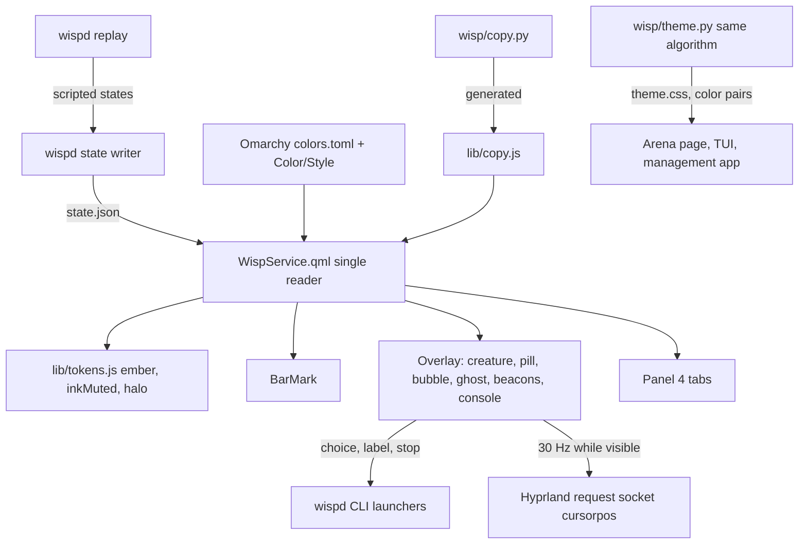
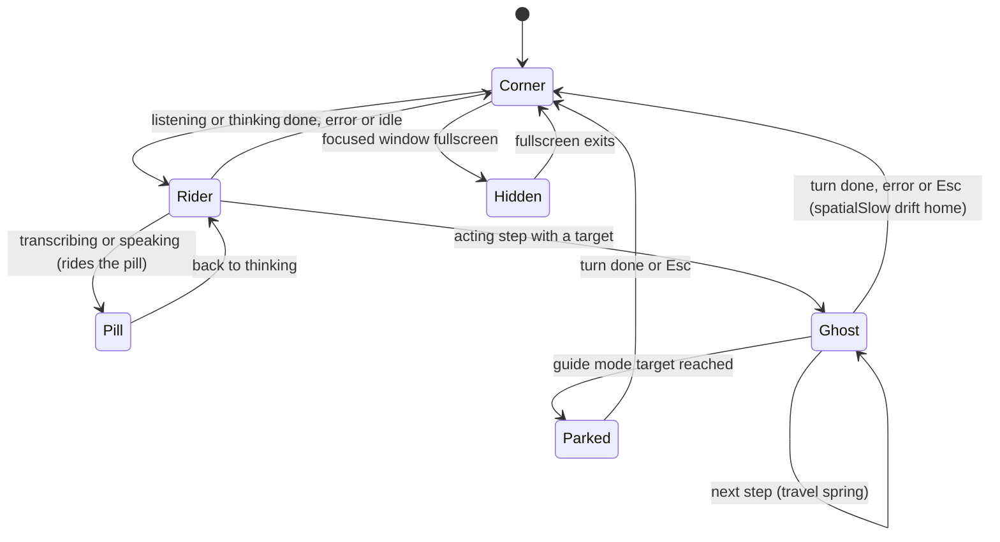
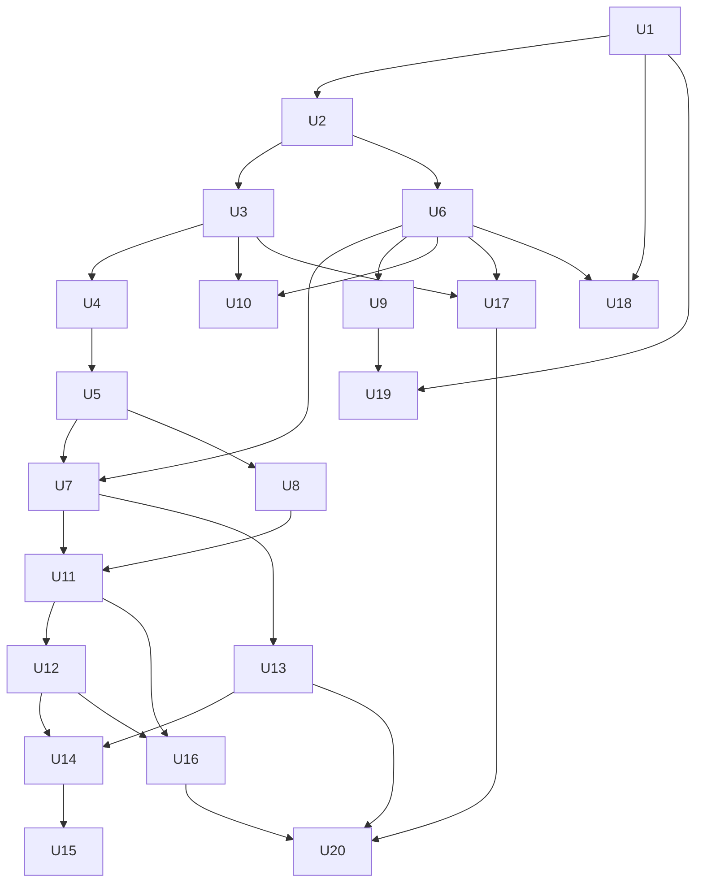

# Wisp Ember Redesign - Plan

## Goal Capsule

- **Objective:** Wisp looks and behaves like a native part of whichever Omarchy theme is active, with one recognizable living element (the Wisp light) that shows what Wisp is doing, leads the user's eye when it acts, and gets out of the way when it is done.
- **Means:** implement `DESIGN-v2.md` ("Ember in the terminal") as PR-sized units: one token adapter and one state reader first, then owned custom assets, then each surface, then the secondary surfaces and README (KTD1 to KTD12).
- **Authority hierarchy:** user instructions > this plan's Requirements > `DESIGN-v2.md` (origin spec) > `docs/plans/2026-10-02-003-feat-wisp-companion-ux-plan.md` invariants > `DESIGN.md` v1 (history only). When this plan deviates from `DESIGN-v2.md`, the deviation is a numbered KTD with its reason.
- **Execution profile:** Deep, 20 units, each one PR. Foundations (U1 to U5) land before any visible surface change. QML-heavy work is verified by offscreen snapshots plus one live `grim` capture per surface unit.
- **Stop conditions:** stop and ask if (a) the user's uncommitted `shell-plugin/Companion.qml` and `scripts/clicklab/run.py` changes are still uncommitted when U4 starts, (b) the Omarchy plugin `shell` facade cannot return the plugin's own service to the overlay entry point (KTD1 fallback needs a decision), (c) the creature shader cannot hold the DESIGN-v2 section 8 performance budget on the AGX GPU, or (d) any unit would need a paid API call or AI-generated imagery.
- **Who finishes:** an implementing agent (`ce-work`) per unit; the user commits the in-flight work, approves the open questions, and runs the one live multi-theme pass (U20) because it switches the desktop theme.

---

## Product Contract

### Summary

Replace Wisp's private Tokyo Night look with chrome that inherits the active Omarchy theme's colors, rounding and font, and make a single shader-drawn creature the only glowing, moving, round element. The creature replaces the orb, rides near the cursor during a turn, and becomes the ghost cursor when Wisp acts. Every Unicode stand-in icon is replaced by an owned vector set; five earcons, an app icon and a recorded README demo are added. The same pass fixes duplicated surfaces, conflicting state colors, contrast failures and three performance traps.

### Problem Frame

`DESIGN-v2.md` section 2 audits the current UI. The surfaces people actually see (orb, card, pill, bubble, ghost, markers in `shell-plugin/Companion.qml`) use hardcoded Tokyo Night hex and ignore the Omarchy theme, so on the user's Vantablack desktop the companion looks like a foreign app. Red means four different things across surfaces, the same transcript and choices render in up to three places, every icon is a Unicode glyph that depends on font fallback, and two text/indicator pairs fail WCAG contrast (2.76:1 and 2.14:1). Four separate `state.json` readers, an 11-forks-per-second `hyprctl cursorpos` loop and several `Animation.Infinite` loops cost CPU while Wisp is idle or busy. Omarchy users installing the plugin judge it within seconds by whether it looks like part of their desktop.

The user's uncommitted compress watchdog in `shell-plugin/Companion.qml` (forced collapse after 120s busy or 180s pinned) is a symptom of finding 3: the card has no single job, so it lingers. This plan sequences around that work rather than replacing it blindly (KTD8).

### Requirements

**Theme and tokens**

- R1. Every chrome color resolves from the active Omarchy theme through one adapter; no hex literal remains in shipped QML, HTML or Python UI code outside the adapter's no-Omarchy fallback palette (see origin: DESIGN-v2.md section 5.1).
- R2. Chrome radius follows `Style.cornerRadius` and type uses `Style.font.family` at `Style.font.*` sizes, so a square theme stays square and `omarchy display text size` scales every Wisp surface (origin 5.3, 5.4).
- R3. The creature color ("ember") is derived from the theme per origin 5.2, never reads as an error color, and is used only for the creature, the ghost cursor and the mic-level meter (origin 4.4 role rules).
- R4. A theme switch recolors every open Wisp surface without restarting the shell or running `wispd theme`.

**State semantics and copy**

- R5. One status-word and color map is shared by every surface: `urgent`/`fail` means failed only, `needsYou` means waiting on the user only, and every state differs by icon or motion as well as hue (origin 5.1, 5.9, 7).
- R6. UI copy follows origin 5.9: lowercase status words, human verbs, no protocol strings, no em-dashes, raw tool names and raw result strings only behind a details disclosure.
- R7. No emoji or Unicode symbol is used as an icon anywhere in the shell plugin, management app, TUI or arena page.

**Surfaces**

- R8. Each piece of information has one home: live progress and choices in the pill, answers in the cursor bubble, history and step detail in the console, which opens only on user action, `awaiting_choice` or a confirm (origin 6.2, 6.3).
- R9. The bar mark, corner creature, pill, bubble, ghost cursor, beacons, console and panel all follow the component states in origin 5.8.
- R10. The ring around the user's own pointer is removed; the Wisp rides at an offset near the pointer during a turn and travels to targets as the ghost cursor when acting (origin 6.5, 6.6).
- R11. The panel regroups seven tabs into four (Now, Agents, Wiring, Stats) without dropping any data it shows today (origin 6.9).
- R12. The management app, TUI and training-arena page use the same tokens; the clicklab fixture page geometry stays frozen (origin 6.10 to 6.12).

**Interaction, error handling and accessibility**

- R13. Choices, confirms and stop have a keyboard path that works without overlays taking keyboard focus (origin 6.3, 6.8, 7).
- R14. Every error state says what happened and offers one next action; daemon-offline and stale-state conditions are shown as such, never as a frozen UI that looks live.
- R15. Text meets 4.5:1 and state-carrying non-text meets 3:1 against its background on every fixture theme, including at least two light themes.
- R16. Motion follows origin 5.5: no `Animation.Infinite` on chrome, continuous creature motion only in states that need it, and `full`/`reduced`/`off` modes that default from Hyprland's `animations:enabled`.
- R17. Earcons are never the only signal and can be turned off globally or per cue.

**Custom assets**

- R18. All visual and audio assets are original, in-repo, reproducible from committed sources, and made without paid APIs or AI image generation: creature shader (13 states), 7 bar glyphs, 24 UI icons, mark and wordmark, ghost cursor, app icon, 5 earcons, README demo recording.

**Performance**

- R19. Wisp meets the budgets in origin section 8, in particular: one `state.json` reader, zero per-frame process spawns, no `Canvas`, no timers faster than 2s while idle except the creature's redraw ticker (at least 100ms, running only while the creature is visible and motion is `full`), and creature redraw capped at 10 fps when idle.

### Key Decisions

- **Direction is "Ember in the terminal".** Omarchy chrome everywhere, one exception: the creature. Glass, mascot and Tokyo-Night-as-brand were rejected in origin 4.2. Governs R1 to R3.
- **The Wisp is the ghost cursor.** One continuous character replaces the orb plus separate arrow. Governs R10.
- **No paid API calls and no AI-generated imagery** for any asset or capture (caller constraint). Governs R18.
- **Light themes are in scope from the creature's first version**, not deferred to P2 as origin 6.14 suggests, because every unit's verification must include a light theme. Governs R15, R18.

### Scope Boundaries

- Clicklab `scripts/clicklab/index.html` is not restyled; it is a geometry fixture for `suites.json`.
- No new overlay surface beyond bar, pill, bubble, pointer overlay and console (companion-ux plan invariant). The confirm card is a mode of the bubble.
- The no-focus invariant holds: overlays stay `WlrKeyboardFocus.None` and click-through except chips, bubble actions and the corner creature's own bounds (U11).
- `/usr/share/omarchy/` and the stash-canonical files under `~/.config/hypr/` are never edited (KTD6).

#### Deferred to Follow-Up Work

- Origin "supreme ceiling" items: console morphing out of the creature, origin-aware pill entrance, edge docking, multi-monitor ghost hand-off and "lead" behavior, beacon sequence paths, panel "Ask" field, live 14px bar creature, animated icon transitions, per-theme earcon timbre.
- Opt-in mascot accessories (origin open question 7).
- Hiding overlays from screenshots and recordings (origin open question 8).
- Symlink plugin install (origin open question 9).
- Launch video and `launch-kit` repo (craft-and-launch research Part C).
- `wispd selfcheck --ui` debug IPC for timer counts; per-unit perf measurement covers this program.

#### Considered and not built

- PNG sprite-sheet fallback for the creature (origin A1): replaced by per-state static vector marks, which `motion=off` needs anyway (KTD3). Revisit if a Mesa regression makes static marks too plain.
- Wallpaper-luminance sampling for the creature halo: a fixed `emberHalo` keyline already passes 3:1 on the fixture themes. Revisit if a bright wallpaper fails the halo check in U20.

### Success Criteria

- Side-by-side captures on Vantablack and one light theme read as "part of this desktop" to the user, with the creature as the only glowing element.
- Contrast audit (U1 `wispd theme --check`) passes on all fixture themes.
- Measured idle CPU attributable to Wisp below 0.3% of one core, and zero `hyprctl` forks during a scripted acting turn.

### Outstanding Questions

#### Resolve before the dependent unit

- OQ1 (blocks U14). Submap keybinds: may `wispd` register transient binds at runtime with `hyprctl eval` (recommended, KTD6), or must they live in a sourced file in the stash? Origin question 4.
- OQ2 (blocks U15). May `state.json` gain an additive `confirm` object (recommended; it is not a status value, so the closed status vocabulary in `docs/IPC_CONTRACT.md` is unchanged)? Origin question 3.

#### Deferred to implementation

- OQ3. TTS amplitude: can `wisp/speech.py` expose an envelope through a PipeWire level tap, or does `speaking` use the synthetic 4 to 6 Hz rhythm? U7 ships the synthetic rhythm and leaves a uniform for the real envelope. Origin question 2.
- OQ4. Earcon defaults: plan assumes mic open/close and needs-you/error on, done off (origin A9). Origin question 6.
- OQ5. Creature rest placement: plan assumes corner at rest, riding only during turns. Origin question 1.
- OQ6. Asset production: plan assumes in-house, code-authored assets (no illustrator or sound designer). Origin question 10.

### Assumptions

- The user commits (or otherwise resolves) the uncommitted `shell-plugin/Companion.qml` watchdog and `scripts/clicklab/run.py` changes on `feat/training-arena` before U4. Redesign branches are cut from that tip, or from `master` once `feat/training-arena` merges.
- `DESIGN-v2.md` is currently untracked; U1 commits it and marks the `DESIGN.md` v1 token block superseded.
- Light fixture themes are `catppuccin-latte`, `flexoki-light` and `white` (stock, `mode = "light"` inside `colors.toml`); dark fixtures are `vantablack` (copied from the user override at `~/.config/omarchy/themes/vantablack/colors.toml`, accent `#e58a4b`; the stock vantablack is greyscale), `tokyo-night` and one red-accent theme to exercise the ember-vs-urgent rotation.
- CI (`.github/workflows/test.yml`) has no Qt; QML tests are a local gate and their logic is mirrored in Python tests that CI runs.

---

## Planning Contract

### Key Technical Decisions

- KTD1. **The single reader is the existing manifest `service` entry point, not a new `qmldir` singleton.** `shell-plugin/WispService.qml` is already the declared service (`manifest.json` `entryPoints.service`, `keepLoaded: true`), and the Omarchy host lets a plugin look up its own service through the injected `shell` facade (`/usr/share/omarchy/shell/README.md`, "ordinary plugins can look up and control only their own service"; `shell.qml` `pluginServiceFor`). Bar, overlay and panel bind to `shell.serviceFor(manifest.id)`. This deviates from origin 6 "P0-0" (delete `WispService.qml`, add a singleton), because a plugin-local singleton would be one instance per import context and duplicates what the host already provides. Cost: changes to a `keepLoaded` service take effect only after an `omarchy-shell` restart, which U3 verification must account for. Fallback if the facade returns null for the overlay entry: a `qmldir` singleton in `shell-plugin/lib/` (stop condition b).
- KTD2. **One token algorithm, two mirrored implementations with shared golden fixtures.** Python (`wisp/theme.py`) is the reference: it parses Omarchy `colors.toml`, derives ember (origin 5.2), computes `inkMuted` and `emberHalo` contrast fixes, and emits `theme.css` for the arena and color pairs for the TUI and management app. QML (`shell-plugin/lib/tokens.js`) ports the same pure functions for live theme switches. Both are tested against `tests/fixtures/themes/<name>/colors.toml` with expected token JSON, so the ports cannot drift. Chosen over Python-only emission because R4 requires live recolor inside the shell without `wispd` running.
- KTD3. **Creature = one GLSL fragment shader baked with `qsb`, with static vector marks as the fallback.** Source `assets/shaders/wisp.frag` and the baked `.qsb` are both committed, rebuilt by a script. One `ShaderEffect` (max 96x96) driven by uniforms; state target vectors (energy, cohesion, heat, gaze, tempo) live in `shell-plugin/lib/creature.js` and blend with springs. If the shader fails to load, or `motion=off`, the creature renders its static mark for the current state. Replaces origin's PNG sprite-sheet fallback (see Scope Boundaries).
- KTD4. **Icons are authored as SVG files and compiled into a JS path-data module.** Source `assets/icons/src/*.svg` (16px grid, 1.5px stroke, square caps, mitred joins, single path) is compiled by `scripts/assets/build_icons.py` into `shell-plugin/lib/icons.js`, rendered by one `Icon.qml` using `Shape`/`PathSvg` with `currentColor` semantics (origin 5.6). No icon font, no PNG for UI icons.
- KTD5. **Cursor position comes from Hyprland's request socket through Quickshell `Socket`, polled at most 30 Hz and only while the ghost, bubble or rider is visible.** Replaces the 90ms `hyprctl cursorpos` fork loop (`Companion.qml` cursor timer). Hyprland's event socket does not stream pointer moves, so a socket request is the cheapest fork-free option. Fallback if the Lua Hyprland build rejects socket requests: one persistent helper process that keeps a single connection open.
- KTD6. **Keyboard parity uses transient runtime binds registered by `wispd` via `hyprctl eval`, never the stash `bindings.lua`.** Binds exist only while `awaiting_choice`, `acting` or a confirm is pending. Each bind is created as a handle stored in a Lua global table and removed with `:unbind()` on that handle, following `/usr/share/omarchy/default/hypr/bindings/utilities.lua`; never unbind by key, which would remove the user's same-key binds. Every chord carries a modifier and must be free in the live `hyprctl binds` output: no bare letters, no bare `Esc`, and not `Super+1..3` (Omarchy workspace switching). The stop bind is suspended while the pipeline runs a `key` tool step, because the agent's own key presses go through Hyprland binds. This narrows origin 6.3's `Super+1..3`/`Esc`/`y a n` keys, which would collide with workspace binds and steal typing. Pending OQ1.
- KTD7. **Copy is owned by Python and generated into QML.** `wisp/copy.py` holds the status-word map, result-prefix translations (`SKIP`, `BLOCKED`, `ASK_USER`) and `pickLabel` humanization; a build step writes `shell-plugin/lib/copy.js`, and a test fails if the generated file is stale. One source for wispd CLI, TUI, panel and overlays (R5, R6).
- KTD8. **The in-flight compress watchdog is kept and moved, not deleted.** U4 moves `compressWatch`/`expandedAt` into the console component unchanged. U11 keeps it as the console's safety net against a stuck daemon status (120s for `awaiting_choice` and busy, 180s for a user-opened console), because a stuck status pinning the UI is a real failure nobody else catches. It is not removed when the console stops auto-expanding.
- KTD9. **Verification renders surfaces offscreen from fixture state and fixture themes; it does not switch the live theme.** Surfaces are split into window-free components so a harness can load each one inside `quickshell -p tests/qml/harness` (not `qmltestrunner`, which cannot load the Quickshell plugin or resolve `qs.*`) under `QT_QPA_PLATFORM=offscreen` with `QT_QUICK_BACKEND=rhi` and `QSG_RHI_BACKEND=opengl` (the default offscreen software backend does not render `ShaderEffect`). The harness root symlinks `Commons` and `Ui` from `/usr/share/omarchy/shell` so `qs.Commons` resolves, injects a fixture theme with `Color.loadColors(<fixture colors.toml text>)` after Color's own startup load, feeds a fixture state, saves PNGs, and reports through its exit code. Fixture themes are injected, not installed. Live checks use `grim` on the current theme plus `wispd replay` (KTD10). The only live theme switch is the user-run pass in U20.
- KTD10. **`wispd replay <script>` publishes scripted state sequences through the normal state writer.** It pauses the daemon's own publishing for the duration, so live overlays can be exercised and recorded deterministically with no model or API call. It serves per-unit live checks and the README recording.
- KTD11. **Earcons are synthesized by a committed stdlib Python script.** `sox` is not installed and SuperCollider is heavy; `wave` plus math keeps the sounds reproducible and editable with zero new dependencies. Playback via preloaded QtMultimedia `SoundEffect` (module present at `/usr/lib/qt6/qml/QtMultimedia`).
- KTD12. **The corner creature moves to `WlrLayer.Top` and hides over fullscreen windows; the pill stays on `Overlay`.** A Wisp waiting on the user (`awaiting_choice`, confirm) must stay visible over fullscreen, so the pill carries that state while the corner creature yields (origin 6.2, finding 10).

### High-Level Technical Design

Data flow after U3. One reader feeds every surface; tokens and copy come from modules shared with Python through generated or mirrored code.

Creature placement as a state machine. The creature is one instance reparented between hosts; states from origin 5.5 drive its parameters within whichever host it is in.

Unit sequencing. Foundations first; the surface units can run in parallel once their asset dependencies land.

### Sequencing Notes

- U4 is the first unit to modify `shell-plugin/Companion.qml`; it waits for the user's watchdog change to be committed (stop condition a) and carries it verbatim.
- No unit touches `scripts/clicklab/run.py`.
- Each surface unit reinstalls the plugin copy (`wispd install`) before live checks; U3 additionally needs an `omarchy-shell` restart because the service is `keepLoaded` (KTD1). Restarts are brief and done once per unit, not per iteration; offscreen snapshots carry iteration.

### System-Wide Impact

- **IPC contract:** additive fields only (`confirm` in U15, `updated_at` in U16, replay pause flag for `wispd replay` in U5). `docs/IPC_CONTRACT.md` is updated in the same PR as each field.
- **Install:** `wispd install` gains icon and sound asset copying and `Icon=wisp` (U8, U9).
- **Config:** new `[ui] motion` and `[ui.sound]` keys documented in `docs/CONFIG.md`; `[ui] theme` remains only as the no-Omarchy fallback selector.
- **Performance:** U3 and U13 remove the two biggest costs; every surface unit measures against R19.

### Risks

| Risk | Mitigation |
|---|---|
| `shell.serviceFor` returns null for the overlay or panel entry | KTD1 fallback singleton; U3 verifies all three entry points before deleting duplicate readers |
| Shader cost on Asahi AGX exceeds budget, or a Mesa update breaks it | 96px cap, <= ~40 ALU target, idle 10 fps cap; static-mark fallback (KTD3); stop condition c |
| Offscreen rendering differs from layer-shell rendering | One live `grim` capture per surface unit on the real shell |
| Hyprland Lua build changes socket or `hyprctl eval` semantics | KTD5 and KTD6 fallbacks; both verified at the start of U13 and U14 |
| `qsb` output differs across Qt updates | Bake script pinned to the system `qsb`; baked file committed and rebuilt in CI-local check |
| Redesign churn conflicts with ongoing `feat/training-arena` work | U4 splits `Companion.qml` early so later units touch small component files |

### Sources

- Origin spec: `DESIGN-v2.md` (sections cited inline as "origin N").
- Prior invariants: `docs/plans/2026-10-02-003-feat-wisp-companion-ux-plan.md`.
- Omarchy host facts: `/usr/share/omarchy/shell/README.md` (plugin kinds, service lookup, keepLoaded restart rule), `Commons/Style.qml` (spacing, radius, border alphas), `Commons/Color.qml` (writable base colors, `popups.*`).
- Hotspots: `shell-plugin/Companion.qml` (hardcoded palette near the top, cursor timer and `hyprctl cursorpos` process, `Canvas` arcs, `Animation.Infinite` loops), `shell-plugin/BarWidget.qml` (own `FileView`, `Color.tertiary`), `shell-plugin/Panel.qml` (several `FileView`s plus refresh timer), `wisp/theme.py` (two Tokyo Night palettes), `wispd` install block (`Icon=audio-input-microphone`, plugin `copytree`).
- Quality checklist: craft-and-launch research A.3 (five states, error-handling UX, ship gate), carried into the Verification Contract.

---

## Implementation Units

### Unit Index

| U-ID | Title | Key files | Depends on |
|---|---|---|---|
| U1 | Omarchy token adapter (Python reference) | `wisp/theme.py`, `tests/test_theme.py` | none |
| U2 | QML tokens, motion tokens and generated copy | `shell-plugin/lib/tokens.js`, `wisp/copy.py`, `shell-plugin/lib/copy.js` | U1 |
| U3 | Single state reader | `shell-plugin/WispService.qml`, `BarWidget.qml`, `Panel.qml`, `Companion.qml` | U2 |
| U4 | Split Companion into window-free components | `shell-plugin/components/*.qml` | U3 |
| U5 | Snapshot harness and `wispd replay` | `scripts/ui/snap.py`, `tests/qml/`, `wispd` | U4 |
| U6 | Icon, bar-glyph and mark set | `assets/icons/src/`, `shell-plugin/lib/icons.js` | U2 |
| U7 | Creature shader, 13 states | `assets/shaders/`, `shell-plugin/components/WispCreature.qml` | U5, U6 |
| U8 | Earcons | `scripts/assets/make_earcons.py`, `assets/sound/` | U5 |
| U9 | App icon and desktop entry | `assets/icons/app/`, `wispd` | U6 |
| U10 | Bar mark | `shell-plugin/BarWidget.qml` | U3, U6 |
| U11 | Corner creature and on-demand console | `components/Corner.qml`, `components/Console.qml` | U7, U8 |
| U12 | Pill and cursor bubble | `components/Pill.qml`, `components/Bubble.qml` | U11 |
| U13 | Fork-free cursor, rider, ghost cursor, beacons | `components/GhostCursor.qml`, `components/Beacon.qml` | U7 |
| U14 | Keyboard submap and Esc stop | `wisp/keys.py`, `wispd` | U12, U13 |
| U15 | Confirm card | `wisp/state.py`, `components/Bubble.qml` | U14 |
| U16 | Error, offline and stale-state UX | `wisp/state.py`, `wisp/copy.py`, components | U11, U12 |
| U17 | Panel four tabs | `shell-plugin/Panel.qml` | U3, U6 |
| U18 | Management app and TUI on shared tokens | `shells/debug/shell.qml`, `wisp/tui.py` | U1, U6 |
| U19 | Training arena restyle | `scripts/clicklab/arena.html`, `arena.py` | U1, U9 |
| U20 | README media and program QA pass | `README.md`, `assets/readme/` | U13, U16, U17 |

### U1. Omarchy token adapter (Python reference)

- **Goal:** one function turns an Omarchy `colors.toml` into the Wisp token set, including ember, contrast-corrected `inkMuted` and `emberHalo`.
- **Requirements:** R1, R3, R15; KTD2.
- **Dependencies:** none.
- **Files:** modify `wisp/theme.py`, `wispd` (`theme --check`, `theme --css`), `DESIGN.md` (superseded note); add `DESIGN-v2.md` to the repo; create `tests/test_theme.py`, `tests/fixtures/themes/{vantablack,tokyo-night,white,catppuccin-latte,flexoki-light,red-accent}/colors.toml` and matching `expected.json`.
- **Approach:**
  1. Parse `colors.toml` with `tomllib`; map keys to origin 5.1 tokens.
  2. Implement ember derivation per origin 5.2 in OKLCH (chroma floor, deltaE-vs-urgent rotation, lightness clamp by `mode`).
  3. `inkMuted`: start from `muted`, mix toward `ink` until 4.5:1 on `canvas`. `emberHalo`: pick background or foreground keyline for 3:1.
  4. Keep the two Tokyo Night palettes only as the fallback when no Omarchy theme exists.
  5. `wispd theme --check` prints each token pair's contrast and exits non-zero on failure; `--css` writes `theme.css`.
- **Patterns to follow:** existing atomic write in `theme.emit`; `wispd theme` subcommand dispatch.
- **Test scenarios:**
  - Vantablack fixture (user override copy) yields ember `#e58a4b` (its own accent) within rounding.
  - `white` fixture (accent `#6e6e6e`, low chroma, no `orange` key) falls back to its `yellow` `#4a4a4a`, then lightness-clamped.
  - Red-accent fixture rotates ember away from `red` to `orange` or `yellow`.
  - Light fixtures clamp ember lightness to 0.45 to 0.60.
  - Every fixture's `inkMuted` on `canvas` is at least 4.5:1, including Tokyo Night where raw `muted` fails.
  - Missing `colors.toml` returns the dark fallback palette and marks `source: fallback`.
  - `colors.toml` missing optional keys (`orange`, `lighter_background`) falls back per origin 5.1 table without raising.
  - `theme --css` output contains every token as a CSS custom property and no other hex.
- **Verification:** all fixture tests pass; `wispd theme --check` passes on the live theme.

### U2. QML tokens, motion tokens and generated copy

- **Goal:** QML surfaces get the same tokens as U1 live, plus motion tokens and one copy map.
- **Requirements:** R4, R5, R6, R16; KTD2, KTD7.
- **Dependencies:** U1.
- **Files:** create `shell-plugin/lib/tokens.js`, `shell-plugin/lib/motion.js`, `wisp/copy.py`, `shell-plugin/lib/copy.js` (generated), `scripts/assets/gen_copy.py`, `tests/test_copy.py`, `tests/qml/lib/tst_tokens.qml`; modify `wisp/config.py` (new `[ui] motion` default, validated against `full`/`reduced`/`off`) and `docs/CONFIG.md`.
- **Approach:**
  1. Port U1's pure functions to JS; inputs are the `Color` singleton values plus the extra ANSI keys from `colors.toml`.
  2. `motion.js` holds origin 5.5 spring and duration tokens and resolves the motion mode (config value, else Hyprland `animations:enabled`).
  3. `wisp/copy.py` holds the status-word map, result-prefix translations and `pickLabel`; `gen_copy.py` writes `copy.js`.
- **Test scenarios:**
  - `tst_tokens.qml` loads each U1 fixture and matches `expected.json` within one 8-bit channel step.
  - `copy.py` maps every status in `docs/IPC_CONTRACT.md` to a word; an unknown status maps to "offline".
  - `SKIP (launch route but no app identified)` translates to "didn't catch which app" and flags `didnt_understand`.
  - `BLOCKED (tool 'x' needs confirmation)` translates to "blocked: needs your ok".
  - `test_copy.py` fails when `copy.js` is stale relative to `copy.py`.
  - No translated string contains an em-dash or en-dash.
- **Verification:** Python tests pass in CI; `qmltestrunner` passes locally on the pure-JS lib tests (`tokens.js`, `motion.js`, `copy.js` have no Quickshell imports).

### U3. Single state reader

- **Goal:** `WispService.qml` is the only reader of `state.json` and `colors.toml`; every surface binds to it.
- **Requirements:** R4, R19; KTD1.
- **Dependencies:** U2.
- **Files:** modify `shell-plugin/WispService.qml`, `shell-plugin/BarWidget.qml`, `shell-plugin/Panel.qml`, `shell-plugin/Companion.qml`, `shell-plugin/manifest.json` (version bump); test `tests/test_plugin_manifest.py`, create `tests/test_plugin_lint.py`.
- **Approach:**
  1. Service exposes every field the surfaces read today (status, transcript, answer, result, choices, points, steps, suggestion, guide, focus, goal, level, tasks, error), the token object, copy helpers and the process launchers (choice, label, interrupt, trigger).
  2. Watch with `FileView`; the 500ms fallback timer runs only while status is not idle or offline. Re-read `colors.toml` from a `Connections` on the `Color` singleton (accent, background, foreground, urgent changes), because Omarchy replaces the theme directory and then pushes only those five colors over IPC; a file watch on the replaced directory is unreliable. Expose the resolved motion mode.
  3. Surfaces resolve the service through `shell.serviceFor(manifest.id)`; delete their own `FileView`s and timers on state.json. Panel keeps its digest readers (they read other files) but gates them on panel open.
  4. Fix `Color.tertiary` reference.
- **Execution note:** characterization first. Capture today's bar, pill and card behavior for a short replayed turn (or manual fixture writes) before removing readers, and compare after.
- **Test scenarios:**
  - `test_plugin_lint.py`: exactly one QML file contains a `FileView` whose path ends in `state.json`.
  - Same lint: no `Color.tertiary` anywhere.
  - Writing a busy state to `state.json` updates bar, overlay and panel within one watch event.
  - With status idle, no timer under 2s is running other than the creature redraw ticker once U7 lands, and none at all with `motion=off` (inspect via the U5 harness timer probe or a debug property).
  - Theme switch fixture that swaps to a different fixture's full `colors.toml` and then changes `Color` values updates both the Color-sourced tokens and the derived ember.
- **Verification:** live: restart `omarchy-shell` once, run a turn, confirm all three surfaces update; `pidstat` shows no idle wakeups from the old timers.

### U4. Split Companion into window-free components

- **Goal:** each overlay surface is a standalone component; the window wrappers in `Companion.qml` become thin hosts.
- **Requirements:** enables R8 to R10 and KTD9; preserves KTD8.
- **Dependencies:** U3; the user's watchdog change committed.
- **Files:** create `shell-plugin/components/{Pill,Bubble,Console,GhostCursor,Beacon,Corner}.qml`; modify `shell-plugin/Companion.qml`; update the `wispd install` copy to include `components/` and `lib/`.
- **Approach:**
  1. Move each surface's visual tree into its component with inputs as properties; windows keep layer-shell settings only.
  2. Move `compressWatch`, `expandedAt` and `userPinned` into `Console.qml` without behavior change.
  3. No visual change in this unit.
- **Execution note:** pure refactor; prove equivalence with before/after `grim` captures of a fixture state, plus the watchdog collapse at its caps using a shortened test interval.
- **Test scenarios:**
  - Console expanded by a busy status collapses after the busy cap; pinned console collapses after the pinned cap (test with intervals overridden).
  - Console expanded during idle is still collapsed by the existing auto-hide, not the watchdog.
  - Installed plugin contains `components/` and `lib/`; manifest test still passes.
- **Verification:** live capture matches the pre-split capture for listening, acting and awaiting_choice fixture states.

### U5. Snapshot harness and `wispd replay`

- **Goal:** any surface can be rendered offscreen for any fixture state and theme, and the live overlays can be driven by scripted state with no model call.
- **Requirements:** R15, R18 (demo), quality checklist "five states"; KTD9, KTD10.
- **Dependencies:** U4.
- **Files:** create `scripts/ui/snap.py`, `tests/qml/harness/Snap.qml`, `tests/fixtures/states/*.json` (one per status plus edge cases), `tests/fixtures/replays/{ask,act,choose,error}.json`; modify `wispd` (`replay` subcommand), `wisp/state.py` (pause flag); create `tests/test_replay.py`.
- **Approach:**
  1. Harness runs per KTD9 (`quickshell -p tests/qml/harness`, offscreen, RHI OpenGL backend): loads one component, injects a fixture theme, sets inputs from a fixture state, and saves a PNG. It fails if the scenegraph backend is `software` while a `ShaderEffect` is present.
  2. `snap.py` renders the surface by state by theme matrix into a contact sheet (gitignored output dir) and reports contrast of sampled text/background pairs.
  3. `wispd replay` publishes each scripted snapshot with its delay through the state writer, holding a pause flag so the daemon's own publishes wait.
- **Test scenarios:**
  - Replay of `ask.json` writes the scripted statuses in order with the scripted delays (tolerance 50ms).
  - A daemon publish attempted during replay is deferred, then applied after replay ends.
  - Replay of a script with an unknown status is rejected before writing anything.
  - Harness renders the pill fixture for `listening` on `vantablack` and `catppuccin-latte` to non-empty PNGs.
- **Verification:** contact sheet for current (pre-redesign) surfaces renders on 2 themes; this becomes the "before" set for every later unit.

### U6. Icon, bar-glyph and mark set

- **Goal:** owned vector set: 24 UI icons, 7 bar states, the Wisp mark, the wordmark, the ghost-cursor silhouette and the beacon.
- **Requirements:** R7, R18; KTD4.
- **Dependencies:** U2.
- **Files:** create `assets/icons/src/*.svg`, `assets/brand/{mark,wordmark}.svg`, `scripts/assets/build_icons.py`, `shell-plugin/lib/icons.js` (generated), `shell-plugin/components/Icon.qml`, `tests/test_icons.py`, `assets/LICENSE` (CC0 or MIT note).
- **Approach:**
  1. Draw on the origin 5.6 grid; round caps only on the mark.
  2. `build_icons.py` validates each SVG (viewBox 16, one path, no fills except the mark), runs `svgo`, and writes path data plus stroke metadata into `icons.js`.
  3. `Icon.qml` takes `name`, `color`, `size`; size scales with `Style.font.icon`.
  4. Render a review contact sheet with `resvg` at 16, 24 and 48 px on dark and light backgrounds.
- **Test scenarios:**
  - Every icon named in origin A3/A4 exists in `icons.js`.
  - Every `Icon { name: ... }` used in QML resolves to an existing icon (static scan).
  - A source SVG with two paths or a non-16 viewBox fails the build with the file name.
  - `build_icons.py` output is byte-identical across two runs (skipped when `svgo` is not on PATH, as on CI runners; validation and name-resolution tests need no external tools).
- **Verification:** contact sheet reviewed by eye at 16px for distinguishability of the 7 bar states.

### U7. Creature shader, 13 states

- **Goal:** the Wisp creature renders all origin 5.5 states on dark and light themes within budget.
- **Requirements:** R3, R16, R18, R19; KTD3.
- **Dependencies:** U5, U6.
- **Files:** create `assets/shaders/wisp.frag`, `assets/shaders/wisp.frag.qsb`, `scripts/assets/bake_shaders.sh`, `shell-plugin/components/WispCreature.qml`, `shell-plugin/lib/creature.js`, `tests/qml/lib/tst_creature.qml`, `tests/test_assets_baked.py`.
- **Approach:**
  1. Uniforms: energy, cohesion, heat, gaze, level, flicker seed, time, mode (dark additive vs light ink-in-water), plus an envelope uniform for OQ3.
  2. `creature.js` holds the 13 target vectors and the transient rules (confirmed spike, didnt_understand shake, beckon at most twice, error dims then returns after 6s).
  3. Idle uses aperiodic shader noise and drives redraw at most 10 fps; continuous 60 fps only in listening, thinking, speaking and travel.
  4. `reduced`: brightness and hue only; `off` or load failure: static mark from U6 per state.
  5. The synthetic 4 to 6 Hz speaking rhythm modulates energy at low amplitude so luminance change stays within the origin 7 rule (no flashing above 3 Hz at high contrast); under `reduced` it becomes a slow single pulse.
  6. Idle redraw is driven by one ticker of at least 100ms (the R19 exception), not by a vsync-rate animation.
- **Test scenarios:**
  - Each of the 13 statuses (including client-derived `confirmed`, `didnt_understand`, `done`) maps to a vector; unknown maps to `offline`.
  - `awaiting_choice` beckons at most twice, 8s apart, then holds still.
  - `error` returns to idle after 6s unless status changes first.
  - `motion=off` renders the static mark and starts no animation.
  - `test_assets_baked.py`: the committed `.qsb` is newer than or matches the `.frag` hash recorded by the bake script.
- **Verification:** harness contact sheet of 13 states by 2 modes; live: `QSG_RENDER_TIMING=1` dev instance shows creature frame cost and idle redraw cap; 28px rest size readable on Vantablack and a light theme.

### U8. Earcons

- **Goal:** five designed cues that sit under TTS, with config toggles.
- **Requirements:** R17, R18; KTD11.
- **Dependencies:** U5.
- **Files:** create `scripts/assets/make_earcons.py`, `assets/sound/{mic-open,mic-close,needs-you,done,error}.wav`, `shell-plugin/components/Earcons.qml`, `tests/test_earcons.py`; modify `wisp/config.py` defaults, `docs/CONFIG.md`, `wispd` install (copy sounds).
- **Approach:** synthesize per origin A9 from one shared timbre; preload with `SoundEffect`; play on status edges from the service, gated by `[ui.sound]` and global toggle, and suppressed while the default PipeWire sink is muted or Omarchy notification do-not-disturb is readable and on (origin 7).
- **Test scenarios:**
  - Each WAV is 48 kHz, 16-bit, under 250ms, peak at or below -6 dBFS.
  - Script output is deterministic (same bytes on rerun).
  - `[ui.sound] enabled=false` suppresses all cues; `done=false` default suppresses only done.
  - Listening edge plays mic-open once; a repeated listening status does not replay it.
  - With the default sink muted (or DND on), no cue plays and the visual state still changes.
- **Verification:** listen on the live machine under TTS; latency from status edge to sound under 50ms by ear plus `pw-top` check.

### U9. App icon and desktop entry

- **Goal:** Wisp has its own icon in launchers and the README.
- **Requirements:** R18.
- **Dependencies:** U6.
- **Files:** create `assets/icons/app/wisp.svg`, `assets/icons/app/hint/{16,24,32,48}.svg`, `scripts/assets/build_app_icon.sh`, `assets/icons/hicolor/` (generated PNGs); modify `wispd` install (hicolor copy, `Icon=wisp`); test `tests/test_wispd.py`.
- **Approach:** mark on a `darker_background` tile in dark and light variants; small sizes are separate drawings; PNGs rendered with `resvg` and compressed.
- **Test scenarios:**
  - Install into a temp HOME writes `Icon=wisp` and every hicolor size.
  - Each exported PNG has the exact pixel size of its directory.
- **Verification:** icon visible in the Omarchy launcher at 1x and 2x.

### U10. Bar mark

- **Goal:** the bar shows the Wisp mark per state with the shared color semantics.
- **Requirements:** R5, R7, R9.
- **Dependencies:** U3, U6.
- **Files:** modify `shell-plugin/BarWidget.qml`.
- **Approach:** replace the `"✦"` text with the bar-glyph `Icon`; color `ink` idle, ember busy, `needsYou`, `fail`, muted offline; 2px busy strip recolored to ember; tooltip uses copy map plus one line of context; middle click stops.
- **Test scenarios:**
  - Each of the 7 bar states renders its own glyph (harness).
  - `awaiting_choice` uses `needsYou`, `error` uses `fail`, `acting` uses ember (no state shares red).
  - Middle click while busy runs the interrupt launcher; while idle does nothing.
  - Tooltip for `awaiting_choice` reads "your call", never the raw status.
- **Verification:** live bar capture on the current theme; harness on 2 themes.

### U11. Corner creature and on-demand console

- **Goal:** the orb becomes the creature at rest, and the card becomes a console that opens only when needed.
- **Requirements:** R2, R8, R9, R14; KTD8, KTD12.
- **Dependencies:** U7, U8.
- **Files:** modify `shell-plugin/components/Corner.qml`, `shell-plugin/components/Console.qml`, `shell-plugin/Companion.qml`; create `shell-plugin/components/{StepRow,ActionButton,Chip}.qml`.
- **Approach:**
  1. Corner window to `WlrLayer.Top`, margin `Style.gapsOut`, hidden when the focused window is fullscreen; no disc, no glyph, no `Canvas`. Its input region is the creature's bounds only. Click opens the console; hover reveals "talk" and "hide" actions at 28px minimum hit size (origin 6.2). "hide" keeps the corner creature hidden until the next Super+D or bar click.
  2. Console opens on click, `awaiting_choice` or confirm; content order per origin 6.2; answer not duplicated unless the bubble was dismissed.
  3. Step rows use icon per tool family and humanized verb; raw tool name and raw result behind a details disclosure with copy.
  4. Keep the watchdog per KTD8.
- **Test scenarios:**
  - `listening`, `deciding`, `acting` statuses do not open the console.
  - `awaiting_choice` opens the console; resolving the choice closes it.
  - Busy-stuck fixture (status `acting` never changes) collapses the console at the busy cap.
  - Fullscreen focused window hides the corner creature; pill still shows `awaiting_choice`.
  - Step `SKIP (route='x' action='y' unhandled)` shows humanized text with the raw string only in details.
- **Verification:** replayed ask, act and choose scripts captured live; harness on 2 themes; no `Canvas` or `Animation.Infinite` left in these components (lint).

### U12. Pill and cursor bubble

- **Goal:** the pill owns live progress and choices; the bubble owns answers.
- **Requirements:** R6, R8, R9, R13, R15.
- **Dependencies:** U11.
- **Files:** modify `shell-plugin/components/Pill.qml`, `shell-plugin/components/Bubble.qml`; create `shell-plugin/components/LabelPrompt.qml`.
- **Approach:**
  1. Pill: one row, radius rule from origin 5.4, riding creature, status word, transcript tail with mic icon (not italic), ember keyline scaled by level, humanized choices with key hints.
  2. Bubble: `type.answer`, 60ch, 12 lines then "more" opens the console, ember streaming caret, dwell 9s plus 40ms per word paused on hover, flips left or above at screen edges and never covers the pointer hotspot.
  3. Bubble footer after finish: LabelPrompt (check and cross icons), copy, pin; "noted" with 5s undo; offered once per turn.
- **Test scenarios:**
  - Choices render only in the pill; console shows none while the pill is visible.
  - Five choices: first three show key hints `1 2 3`, the rest are click or voice only.
  - A 40-line answer shows 12 lines and a "more" chip; clicking opens the console with the full answer.
  - Cursor at the right screen edge places the bubble to the left of the pointer.
  - Label check then undo within 5s sends the label then its reversal; after 5s undo is gone.
  - Hint text contrast on every fixture theme is at least 4.5:1 (harness).
- **Verification:** live replay of ask and choose; harness matrix on 2 themes.

### U13. Fork-free cursor, rider, ghost cursor, beacons

- **Goal:** the Wisp rides near the pointer during a turn and travels as the ghost cursor; tracking costs no process spawns.
- **Requirements:** R10, R16, R19; KTD5.
- **Dependencies:** U7.
- **Files:** create `shell-plugin/lib/cursor.js` or a `CursorFeed` item in `WispService.qml`; modify `shell-plugin/components/GhostCursor.qml`, `shell-plugin/components/Beacon.qml`, `shell-plugin/Companion.qml`.
- **Approach:**
  1. Verify first that the Hyprland request socket answers `cursorpos` on this build; else use the KTD5 fallback.
  2. Feed runs at most 30 Hz and only while the rider, ghost or bubble is visible.
  3. Remove the user-pointer ring; rider sits at +18,+18 from the pointer with `spatialDefault` lag.
  4. Ghost: A5 silhouette carrying the creature; distance-scaled travel, curved path, single 220ms click ripple, last 3 breadcrumbs fading over 2s, guide mode parks and holds still.
  5. Beacons: land with one spring overshoot, hold, fade after 8s or next turn.
- **Test scenarios:**
  - During a replayed acting turn, no `hyprctl` process is spawned (process count probe).
  - Feed stops when no consumer is visible; restarts when the bubble shows.
  - Travel duration for 1000px is 520ms cap; for 100px is 345ms.
  - Guide-mode target reached: ghost holds still with label chip "click Settings", no loop running.
  - `motion=reduced`: travel becomes a 140ms cross-fade.
  - Beacon fixture with 3 points shows 3 beacons, each settling once.
- **Verification:** `pidstat`/process count during replay; `QSG_RENDER_TIMING` during travel; live capture of a ghost travel.

### U14. Keyboard submap and Esc stop

- **Goal:** choices, stop and (later) confirms are reachable by keyboard without overlays taking focus.
- **Requirements:** R13; KTD6. Blocked by OQ1.
- **Dependencies:** U12, U13.
- **Files:** create `wisp/keys.py`, `tests/test_keys.py`; modify `wispd` (`choice --index`), `wisp/pipeline.py` or the status transition point, `docs/CONFIG.md`.
- **Approach:** at the start, read the live `hyprctl binds` and choose modifier chords for choice 1 to 3 and stop that are free (KTD6); record them in `docs/CONFIG.md`. On entering `awaiting_choice` or `acting`, register them as handles through `hyprctl eval`; remove them by handle on exit, on daemon shutdown, and on startup (stale cleanup). Suspend the stop bind during `key` tool steps. The pill shows the chord hints at the moment the binds register.
- **Test scenarios:**
  - Entering `awaiting_choice` issues one register call; leaving issues one remove call.
  - Daemon startup removes any leftover Wisp binds.
  - `wispd choice --index 2` picks the second choice; an out-of-range index is rejected with a message.
  - `hyprctl eval` failure is logged and the turn continues mouse- and voice-only.
  - After a choose turn, Omarchy's workspace binds and any user bind on the same keys are still present.
  - A scripted `key esc` step during acting does not interrupt the turn.
- **Verification:** live: replayed choose script answered with `Super+2`; `Esc` during a replayed act stops it; binds absent afterwards.

### U15. Confirm card

- **Goal:** risky tools ask for approval inline at the cursor instead of only by voice.
- **Requirements:** R9, R13, R14. Blocked by OQ2.
- **Dependencies:** U14.
- **Files:** modify `wisp/state.py`, `wisp/pipeline.py` (confirmation path that today returns `BLOCKED ... needs confirmation`), `docs/IPC_CONTRACT.md`, `shell-plugin/components/Bubble.qml`, `wisp/keys.py`; tests `tests/test_contract.py`, `tests/test_pipeline.py`.
- **Approach:** additive `confirm = {tool, app, summary, risk}`; bubble switches to confirm mode with `needsYou` keyline and "allow once / allow for this app / deny"; modifier chords from the KTD6 free-chord set, shown in the bubble footer. Confirm mode ignores the answer dwell and stays until answered, stopped, or 120s elapse; a timeout resolves as deny and the creature returns to idle.
- **Test scenarios:**
  - A tool needing confirmation publishes `confirm` and waits; "allow once" runs it once.
  - "allow for this app" persists and skips the next confirm for the same app and tool.
  - "deny" publishes a result the copy map renders as "skipped: you said no".
  - Contract test: `confirm` absent by default; existing status vocabulary unchanged.
  - A pending confirm left unanswered for 120s resolves as deny and publishes the deny result.
  - A pending confirm survives past the bubble's answer dwell.
  - A pending confirm registers no unmodified letter bind.
- **Verification:** live replay of a confirm script answered by key and by click.

### U16. Error, offline and stale-state UX

- **Goal:** every failure is visible, honest and recoverable from the surface where it appears.
- **Requirements:** R6, R14.
- **Dependencies:** U11, U12.
- **Files:** modify `wisp/state.py` (additive `updated_at`), `wisp/copy.py`, `shell-plugin/WispService.qml`, `shell-plugin/components/{Console,Pill}.qml`, `shell-plugin/BarWidget.qml`, `docs/IPC_CONTRACT.md`; tests `tests/test_contract.py`, `tests/test_copy.py`.
- **Approach:**
  1. Offline (no state file or daemon gone): bar offline mark, tooltip "wisp is offline", action "start wisp" that runs the user service start.
  2. Heartbeat: while status is not idle, `wispd` re-publishes every 15s, updating only `updated_at`. Stale: busy status with `updated_at` older than 60s shows "reconnecting" instead of the live state; watchdog still collapses.
  3. Error: "that failed" plus one next action (retry the last utterance, open log, or details with copy).
  4. Degraded paths: shader load failure uses static marks, missing theme file uses fallback tokens, sound failure is silent; each logs once.
- **Test scenarios:**
  - Deleting `state.json` turns every surface offline within one watch event.
  - Busy fixture with `updated_at` 90s old renders "reconnecting".
  - A long busy step with heartbeats arriving every 15s never shows "reconnecting".
  - Error fixture shows exactly one primary action and a details disclosure containing the raw error.
  - `updated_at` is present on every publish and absent fields stay backward compatible (contract test).
- **Verification:** live: stop the user service during a replay and confirm offline then recovery after restart.

### U17. Panel four tabs

- **Goal:** the panel reads like a product, not a debugger, with no data lost.
- **Requirements:** R5, R6, R7, R9, R11.
- **Dependencies:** U3, U6.
- **Files:** modify `shell-plugin/Panel.qml`; create `shell-plugin/components/{PanelTab,AgentRow,ConnectorRow,EmptyState}.qml` as needed.
- **Approach:** Now (current turn, recent turns, label prompt), Agents (row with elapsed, last line, open log, cancel), Wiring (context, connectors, searchable skills), Stats (turns, success rate, median latency with inline bars, decision log). Accent underline tabs, `qs.Ui` section headers and separators, no raw JSON or file names in copy, empty state per tab.
- **Test scenarios:**
  - Every field shown by the old seven tabs appears in one of the four (checklist test over a fixture).
  - Mode badge for agent mode no longer uses `urgent` or `#fff`.
  - Empty agents list shows one sentence plus one command.
  - Stats with zero turns shows the empty state, not NaN.
- **Verification:** harness on 2 themes; live open of each tab.

### U18. Management app and TUI on shared tokens

- **Goal:** secondary surfaces match the theme.
- **Requirements:** R1, R6, R7, R12.
- **Dependencies:** U1, U6.
- **Files:** modify `shells/debug/shell.qml`, `wisp/tui.py`; test `tests/test_tui_render.py`.
- **Approach:** the management app is a separate Quickshell process that Omarchy's theme IPC never reaches, so `wispd install` copies `shell-plugin/lib/tokens.js` beside it and the app re-reads `colors.toml` whenever `~/.local/state/omarchy/current/theme.name` changes, then drops `#16161e`; TUI uses ANSI colors 0 to 15 so the Omarchy terminal palette applies, header "wisp" plus status word from `copy.py`.
- **Test scenarios:**
  - TUI renders a fixture state with status words from the copy map and no Unicode icon glyphs.
  - `shells/debug/shell.qml` contains no hex literal (lint).
- **Verification:** screenshot of each in the current theme and one fixture light theme (TUI via a light terminal profile).

### U19. Training arena restyle

- **Goal:** the arena page uses generated tokens and a two-zone layout.
- **Requirements:** R1, R7, R12.
- **Dependencies:** U1, U9.
- **Files:** modify `scripts/clicklab/arena.html`, `scripts/clicklab/arena.py` (serve `theme.css` and favicon); do not modify `scripts/clicklab/index.html` or `run.py`.
- **Approach:** drop the hex block, violet `h1 b`, dashed rows and 3-column cards; live run feed as the dominant left zone, skill bank and stats right, hairline separators, tabular numerals, `prefers-reduced-motion`, favicon from U9.
- **Test scenarios:**
  - `arena.py` serves `theme.css` generated from the current theme, and the fallback palette when none exists.
  - `arena.html` contains no hex literal.
  - `index.html` is byte-identical to its pre-program version (guard test).
- **Verification:** BrowserOS neo screenshots at 1440 and 390 widths in a dark and a light theme css.

### U20. README media and program QA pass

- **Goal:** the README shows the real product, and the whole redesign is checked against the quality bar once more.
- **Requirements:** R15, R18, R19; success criteria.
- **Dependencies:** U13, U16, U17.
- **Files:** modify `README.md`; create `assets/readme/{hero.webm,hero.gif,states.png,social.png}`, `scripts/ui/record_demo.sh`, `assets/readme/social.svg`.
- **Approach:**
  1. Record a 6 to 8s hero with `gpu-screen-recorder` region capture while `wispd replay` plays a scripted ask-then-act turn; GIF via `gifski` at 3 MB or less.
  2. User-run step: repeat the recording on one light theme, then restore the original theme; compose side by side with `ffmpeg`.
  3. State contact sheet from the U5 harness; social preview from an SVG template rendered with `resvg`.
  4. QA pass: perf budgets (R19), contrast audit, friction log for first run, error path and return visit.
- **Test scenarios:** Test expectation: none -- media and documentation; covered by the QA pass below.
- **Verification:** recordings contain no notifications or personal windows; measured budgets recorded in the PR description.

---

## Verification Contract

| Gate | Command or method | Applies to |
|---|---|---|
| Python unit tests (CI) | `python -m unittest discover -s tests -v` | every unit |
| Compile check (CI) | `python -m py_compile wispd wisp/*.py wisp/tools/*.py tests/*.py` | every unit |
| QML lib tests (local) | `/usr/lib/qt6/bin/qmltestrunner -input tests/qml/lib` (pure-JS modules only) | U2, U7 |
| QML component tests (local) | `QT_QPA_PLATFORM=offscreen QT_QUICK_BACKEND=rhi QSG_RHI_BACKEND=opengl quickshell -p tests/qml/harness` (exit code is the result) | U3, U5, U7, every surface unit |
| QML lint (local) | `/usr/lib/qt6/bin/qmllint` on changed QML | every QML unit |
| Offscreen snapshots | `scripts/ui/snap.py` surface by state by theme, at least `vantablack` and `catppuccin-latte` | every surface unit (U7, U10 to U19) |
| Contrast audit | `wispd theme --check` on the live theme plus the harness contrast report on fixtures | U1, every surface unit |
| Live check | `wispd install`, `wispd replay <script>`, one `grim` capture of the affected surface on the current theme | every surface unit |
| Performance | prerequisite: `omarchy pkg add sysstat` (pidstat is not installed); `pidstat` idle sample (60s) and process-spawn count during a replayed act turn; `QSG_RENDER_TIMING=1` on a dev shell for creature and travel | U3, U7, U13, U20 |
| Static lints | tests that fail on: hex literals outside the adapter, `Canvas`, `Animation.Infinite` on chrome, Unicode symbol icons, em-dashes in copy, more than one `state.json` reader | added progressively U3 to U19 |

Live checks never switch the Omarchy theme; multi-theme evidence comes from fixtures (KTD9), except the user-run step in U20.

## Definition of Done

- Every unit's tests and verification pass, and its PR description includes the before/after contact sheet for 2 themes (one light).
- R1 to R19 each trace to at least one merged unit.
- Static lints are all active and green on the final tree.
- Measured idle CPU and process-spawn results meet R19 and are recorded in U20.
- `DESIGN.md` points to `DESIGN-v2.md` as the current spec; `docs/IPC_CONTRACT.md` and `docs/CONFIG.md` document every new field and key.
- No abandoned experiment code (alternate shaders, unused icon drafts, dead QML) remains in the diff.
