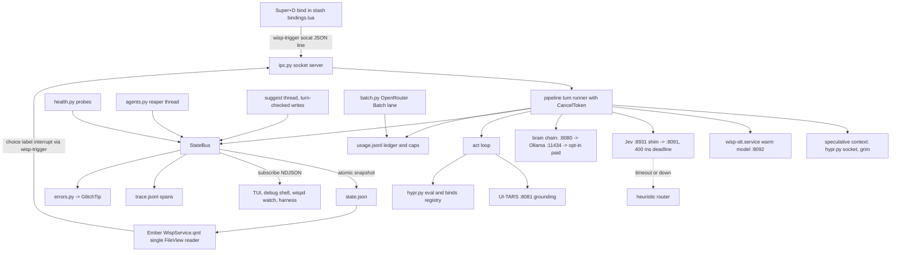
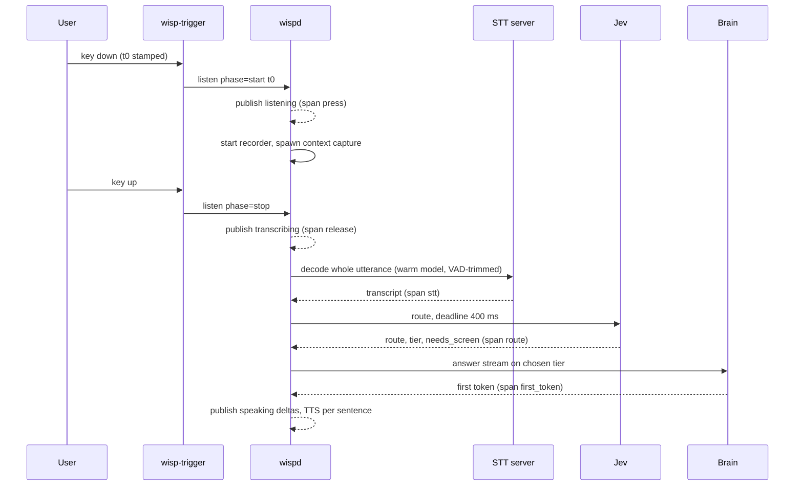
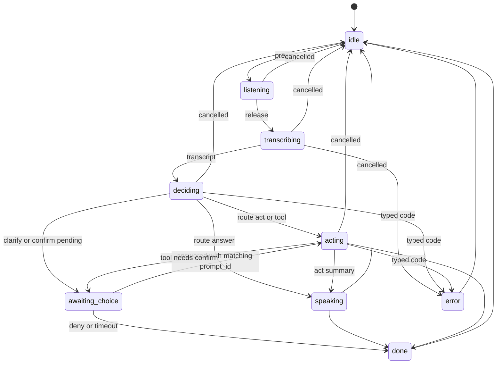
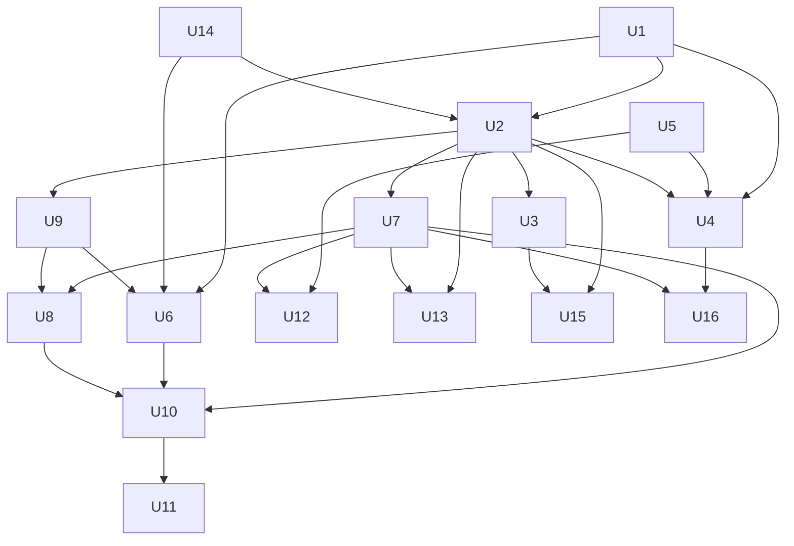

# Wisp Backend Core - Plan

## Goal Capsule

- **Objective:** Pressing Super+D gives an instant, honest response every time: Wisp shows it is listening within a blink, answers or acts in about the time a person would, never looks alive when it is stuck or offline, can be stopped mid-turn, and runs on local models by default so everyday use costs nothing.
- **Means:** a measured latency budget per interaction path (R1), one in-daemon state publisher with a push stream (KTD1, KTD2), a fork-free trigger and Hyprland layer (KTD5, KTD6), warm local STT chosen by benchmark (KTD7), Jev as an accelerator with deadlines and a heuristic fallback (KTD3), endpoint health and fallbacks (KTD8), a usage ledger and offline batch lane (KTD4, KTD10), GlitchTip error reporting (KTD9), and a turn-replay harness with fake model servers (KTD11).
- **Companion plan:** `docs/plans/2026-10-02-2315-feat-wisp-ember-redesign-plan.md` ("Ember") owns every QML surface, the single QML reader (Ember U3), `wispd replay` of state sequences (Ember U5), the fork-free cursor (Ember U13), runtime keybinds `wisp/keys.py` (Ember U14), the confirm card (Ember U15) and error/offline UX copy (Ember U16). This plan builds the daemon foundations those units call and never re-plans them. "Ember Un" always means a unit in that plan; bare "Un" means this plan.
- **Authority hierarchy:** user instructions > this plan's Requirements > `docs/IPC_CONTRACT.md` (frozen except for additive fields) > Ember plan KTDs for anything on the QML side > `docs/brainstorms/2026-10-02-training-gauntlet-research.md` (model tiering direction).
- **Execution profile:** Deep, 16 units, each one PR. U1 (spans) and U14 (turn-replay harness) land first so every later unit is measured. No unit edits QML except the debug shell data source in U3.
- **Stop conditions:** stop and ask if (a) the user's uncommitted `wisp/config.py`, `scripts/clicklab/run.py` or `shell-plugin/Companion.qml` changes are still uncommitted when a unit needs to modify that file (every unit that adds a config key modifies `wisp/config.py`), (b) a unit would need a paid model call outside the U10 caps or outside the `orchestral` eval key for eval paths, (c) the Lua Hyprland request socket stops accepting `eval` or `j/` queries (verified working on 2026-10-03; KTD6 has no fallback transport), (d) GlitchTip ingestion would send transcript text, answers or screenshots off the machine, or (e) a measured budget in R1 is missed by more than 2x after the owning unit lands, judged against the budgets as revised once from the U1 baseline (Sequencing Notes).
- **Who finishes:** an implementing agent (`ce-work`) per unit on a branch cut from `feat/training-arena` after the user commits the in-flight work, or from `master` after it merges. The user answers the blocking open questions (OQ1, OQ2), creates the GlitchTip project and stores its DSN, and runs the one live latency soak (U16 verification).

---

## Product Contract

### Summary

Rebuild Wisp's daemon around measured speed and honest state. Every turn is timed from the keypress. All state flows through one publisher that also streams events, so no reader polls and a crashed or stale turn is detectable. The hotkey and Hyprland queries stop paying process-start costs, and STT stops reloading its model on every use. Jev routes fast and its answer is used to skip work, never to add a gate; when Jev or a local model is down, Wisp says so and falls back rather than failing. Paid models are opt-in, capped and logged, and slow offline work goes through OpenRouter's Batch API at half price. Errors reach GlitchTip without sending what the user said or saw, and every path that sends content off the machine is named and opt-in.

### Problem Frame

Wisp's measured turn today is slow and opaque. Release-to-transcript takes 2.75 s median (4.2 s p90) because `whisper-cli` reloads large-v3-turbo on every utterance. The IPC `listen` release call blocks for a fixed 0.3 s. Every hotkey press and every overlay click starts a full Python interpreter (about 40 ms). Total turn time is 6.1 s median and 26 s p90, and the recorded timings mislabel what they measure (`record_ms` is about 0 in daemon mode, `jev_ms` includes screenshot and hyprctl work, `act_ms` is the whole turn).

Failures are invisible or misleading. On 2026-10-03 the local `llama-jev`, `llama-local` and `llama-uitars` services were stopped at 13:32, and every voice turn after that failed with `Jev HTTP 502 Connection refused`; nothing warned before the user spoke. There are no retries, no health checks beyond a 2 s probe for localhost brains, and no fallback. Raw `URLError` text lands in `status: error`. After a crash `state.json` keeps the last busy status forever, which is why an uncommitted Companion watchdog exists. Interrupt only stops the act loop between steps; STT, Jev and answer streaming cannot be cancelled. Choice picks carry no prompt id, so a stale click can answer a later prompt, and the suggest thread can overwrite a turn that started while it was thinking.

State delivery is wasteful. Four QML readers each watch `state.json` and also reload it every 400 to 500 ms; the mic level meter rewrites the whole file in bursts of nine; the TUI polls IPC every 1.5 s; agent reaping only happens when someone calls `status`. There is no push channel. There is no cost ledger, no error reporting beyond local `trace.jsonl`, the UI-TARS grounding model on :8081 is configured but never called, and the Rust core has drifted from the Python daemon that actually runs.

### Requirements

**Latency and responsiveness**

- R1. Each interaction path meets the budget in the Latency Budget table (Planning Contract), measured from the keypress by U1 spans on this machine with local models warm.
- R2. The press of Super+D produces a visible `listening` state before any model, screenshot or file work starts, and release produces `transcribing` without waiting for audio tail padding.
- R3. Work that does not depend on the transcript (focused window, screenshot, goal/session/memory context) starts while the user is still speaking and is discarded if unused.
- R4. No daemon code path forks a process per frame or on a timer faster than once a minute; Hyprland queries and commands use the request socket.

**State, events and contract**

- R5. Exactly one in-daemon owner writes `state.json`; every write carries `turn_id`, a monotonic `seq` and `contract_version`, and a write from a stale turn is rejected.
- R6. Clients that are not the Ember QML service receive state and events by subscribing to the daemon socket, not by polling a file or IPC.
- R7. Choice and confirm answers carry the `prompt_id` they answer; an answer for any other prompt is rejected with a reason.
- R8. `docs/IPC_CONTRACT.md` matches what the daemon writes, every new field is additive, and a test validates real writer output against it.

**Reliability and degradation**

- R9. The daemon knows the health of every endpoint it depends on before the user speaks and publishes it; a turn that needs a down endpoint fails fast with a typed error code rather than a raw exception string.
- R10. When Jev is down or slower than its deadline, the turn still routes and proceeds; when the local answer brain is down, the turn falls back along a configured chain or says plainly that the brain is offline.
- R11. A stop request cancels the turn at whatever stage it is in (recording, STT, Jev, answer stream, act step, TTS) within 150 ms of the request reaching the daemon.
- R12. A daemon that hangs or dies is detected: the stale-state UX in Ember U16 has the fields it needs, and systemd restarts a hung daemon.

**Cost and models**

- R13. Local models are the default for every runtime path; any paid call is opt-in by config, logged with its cost, and stopped by a daily cap.
- R14. Work that can wait (criteria proposals, recipe proposals, trajectory review) runs through OpenRouter's Batch API when it uses a paid model; no image-bearing request is sent to the batch lane.
- R15. The act loop can resolve a click target with the local UI-TARS-7B grounding model instead of a paid vision model.

**Observability and testing**

- R16. Unhandled exceptions, turn failures and endpoint health transitions reach GlitchTip with release, stage and error code, and never include transcript text, answer text, exception message text, screenshots or file contents.
- R17. A turn can be replayed end to end through the real pipeline against fake Jev, brain, STT and grounding servers, asserting the published state sequence and stage timings, with no network or model call.

### Key Decisions

- **Settled user decisions carried into this plan** are recorded as labeled KTDs (KTD2, KTD3, KTD4, KTD6, KTD9) because each is a how-level choice. Two of them resolve Ember's blocking questions: runtime keybinds resolve Ember OQ1 and the additive `confirm` field resolves Ember OQ2, which unblocks Ember U14 and Ember U15. Governs R7, R10, R13, R14, R16.
- **Backend scope only.** No unit in this plan changes a visible surface; every visible consequence (offline mark, reconnecting, health chip, confirm card, chord hints) is rendered by the Ember unit that owns it, from fields this plan publishes. Governs R6, R9, R12.

### Scope Boundaries

- QML surfaces, tokens, copy text, earcons and the cursor feed belong to the Ember plan. The QML single reader stays a `FileView` on `state.json` (Ember KTD1); moving QML to the push stream is deferred below.
- Ember U5 owns `wispd replay` for scripted state sequences. U14 here replays whole turns through the pipeline with fake endpoints; the two share fixtures but not code paths.
- Ember U14 owns `wisp/keys.py` (which chords, when, hints). U5 here owns the transport (`wisp/hypr.py`) that `keys.py` calls.
- The training-arena program (`docs/plans/2026-10-02-004-feat-wisp-training-arena-plan.md`, gauntlet research) owns the model matrix runner, the T3 reviewer prompt and pass^k reporting. U11 here ships only the generic batch client they can use.
- `/usr/share/omarchy/` and the stash-canonical `~/.config/hypr/*.lua` files are never edited by code or install steps.

#### Deferred to Follow-Up Work

- QML `WispService` reading the push stream through a Quickshell `Socket` instead of `FileView` (removes the last file watch; needs Ember U3 landed first).
- Speculative Jev routing on partial transcripts during recording (needs a streaming STT backend; revisit after U6's benchmark).
- Talker-Reasoner async decider and escalation tags in `act.py` (gauntlet build-order step 3).
- Streaming TTS envelope for the creature (Ember OQ3).
- Bringing `rs/wispd` back to parity (U15 freezes it instead).

#### Considered and not built

- Auto-starting stopped local model services from the daemon: the user stopped them cleanly at 13:32, plausibly to free RAM, and an agent restarting them would fight that intent. U7 surfaces the state and offers a one-command start instead. Revisit if the user asks for lazy start.
- Paid fallback for the answer brain enabled by default: conflicts with local-by-default (KTD4). Shipped as an opt-in chain (OQ3).
- Moving the mic level meter out of `state.json` into its own file: it would add a reader. U2 coalesces it to a fixed rate instead; revisit if U1 shows the 12 Hz rewrite costs more than 1% of a core.
- A Sentry SDK dependency: Wisp has zero runtime dependencies (`pyproject.toml`); a small stdlib envelope client (KTD9) covers what is sent.
- Chunked STT decoding during recording: whisper.cpp encodes a padded 30 s window per request (measured about 1.2 s encode for a 4 s clip with large-v3-turbo on Vulkan), so 2 s chunks would multiply encoder cost instead of hiding it. Revisit only for a backend without the fixed window if U6's choice still misses P3.
- Retries on every model call: one fast retry only on connection refused or reset (KTD8). Retrying timeouts would double the worst-case latency the user waits through.

### Success Criteria

- U1's latency report for a 20-turn soak on this machine meets every R1 row at p50 and stays within 1.5x at p90.
- With `llama-jev` stopped, a spoken "open firefox" still launches Firefox, and the trace shows the heuristic route was used.
- With every local model stopped, the bar shows the offline-brain state (via Ember U16) before the user speaks, and pressing Super+D produces a spoken or shown "local brain is offline" within 1 s of release.
- A week of normal use shows $0.00 of paid runtime spend in `wispd tele` unless the user enabled a paid tier.
- A forced exception in a daemon thread appears in GlitchTip with stage, error code and release, and the event JSON contains no transcript text.

### Outstanding Questions

#### Resolve before the dependent unit

- OQ1 (blocks U13). Which GlitchTip instance and project? The only live instance found is `errors.pacehq.io` (GlitchTip 6.1.8, org `pace-hq`). Plan assumes a new project `wisp` there, DSN stored in omaseal as `glitchtip/wisp`. A personal project in the Pace org may not be what the user wants.
- OQ2 (blocks U6). Is it acceptable to run a resident STT server (warm `whisper-server` from `~/src/whisper.cpp/build/bin/` at roughly 1.6 GB RAM plus Vulkan buffers, or a Parakeet TDT model if U6's benchmark picks it) as a user service alongside the four llama services that share the same GPU? The alternative is keeping per-call `whisper-cli`, which reloads the model each turn.

#### Deferred to implementation

- OQ3. Paid answer fallback: plan ships it opt-in (`[brain] fallback`), off by default. The user may want it on with a small cap.
- OQ5. Does GlitchTip 6.1.8 accept Sentry structured log envelopes? Plan assumes no and keeps `trace.jsonl` as the log of record, sending recent trace events as breadcrumbs (KTD9 call-out).
- OQ6. Parakeet TDT (`parakeet-cli`, built in the same whisper.cpp tree; only a test stub model is present, so a real model download is needed) versus warm whisper large-v3-turbo. Warm whisper has a measured floor of about 1.3 s per utterance (fixed 30 s encoder window), so only Parakeet can meet the 600 ms P3 target; U6 benchmarks both on the replay WAV set and picks by speed and word error rate.
- OQ7. Port for the STT server: plan assumes 8092 (not in the CLAUDE.md port list); confirm free at implementation time.

### Assumptions

- Local Jev stays the `llama-jev` qwen3-4b server on :8091 behind `jev-shim` on :8931 (`WISP_JEV_ENDPOINT`), speaking the `typesafe/jev-1.13` decisions request shape.
- The answer brain stays Ornith-35B on :8080 (`llama-local`), with Ollama `ornith:latest` on :11434 as the CPU fallback.
- The hotkey bind for Super+D stays in the stash `bindings.lua` (lines 111-112 today) and keeps calling `wisp-trigger start|stop`; U4 replaces the script behind that path, so the bind itself does not change. Runtime binds (KTD6) are for transient chords only, because the hotkey must work while the daemon is down.
- OpenRouter Batch API facts used here: inline `requests` array, 202 then poll `GET /batches/{id}`, 24 h completion window, about 50% price, text-only (requests with image parts are rejected at validation).
- Eval-shaped paid calls (`wisp/evalroute.py`, clicklab model runs, batch review of arena runs) bill the `openrouter/orchestral` key through the `orch` wrapper per workspace rules; runtime calls use Wisp's configured key.

---

## Planning Contract

### Latency Budget

Budgets are measured by U1 spans from the client-side keypress timestamp, local models warm, on this machine (M1 Max, Asahi). "Today" is from the existing `trace.jsonl` and `decisions.jsonl`.

| Path | Start -> end | Today | Budget p50 | Owning units |
|---|---|---|---|---|
| P1 press feedback | trigger script start -> `listening` published (key-to-exec latency measured once in U1) | 40-60 ms (+ QML watch, 60-100 ms visible) | 25 ms published, 60 ms visible | U4, U2 |
| P2 release feedback | key up -> `transcribing` published | about 300 ms (fixed sleep) | 25 ms | U4 |
| P3 transcript | key up -> transcript ready (utterance under 6 s) | 2.75 s (p90 4.2 s) | 600 ms with Parakeet; 1.3 s floor if warm whisper is chosen (OQ6) | U6 |
| P4 route | transcript -> route decided | 348 ms (includes screenshot, hyprctl) | 200 ms (Jev deadline 400 ms, then heuristic) | U4, U8 |
| P5 answer | route -> first answer token published | brain_call 346 ms (p90 3.7 s) | 500 ms | U7, U8 |
| P6 spoken | first sentence complete -> TTS audio starts | not measured (TTS off) | 150 ms | U9 |
| P7 act | route -> first tool step started (ghost cursor target published) | not measured | 1.2 s with UI-TARS grounding, 2.5 s with vision LLM | U12, U8 |
| P8 agent | route `agent` -> task registered and acknowledged | not measured | 300 ms | U3 |
| P9 stop | stop request -> turn cancelled, state `idle` | between act steps only | 150 ms | U9 |
| P10 offline | key up with brain or Jev down -> typed error shown | fails after timeout or 502 | 1 s | U7 |

End to end for the answer path: key up -> first answer token p50 at most 1.4 s for a short spoken question with Parakeet (about 2.1 s with warm whisper), down from about 3.5 s. Act and agent paths are judged by their own rows.

### Key Technical Decisions

- KTD1. **One `StateBus` owns every state write.** A single publisher object in `wisp/state.py` takes field updates from any thread through one lock, assigns `seq`, `turn_id`, `updated_at` and `contract_version`, coalesces high-rate fields (mic level at most 12 Hz, answer deltas at most 8 Hz), writes `state.json` atomically as today, and fans the same snapshot out to subscribers. Writers name the turn they belong to; a write for a turn that is no longer current is dropped and traced (fixes the suggest race). Ember U5's replay pause flag and Ember U16's heartbeat are implemented as bus features rather than separate writers. Chosen over per-module writers with a file lock, which cannot reject stale turns or feed a stream.
- KTD2. **Push stream on the existing socket, file stays the snapshot.** A `subscribe` request keeps its connection open and receives newline-delimited JSON: one full snapshot, then `state` diffs and typed `event` records (stage spans, health changes, agent finished, errors). `state.json` stays as the frozen snapshot contract that the Ember QML service watches (Ember KTD1), so the QML side keeps exactly one file reader and nothing else reads the file. Additive `confirm` object and other new fields follow the contract's additive rule. (session-settled: user-directed — chosen over keeping the `docs/IPC_CONTRACT.md` state shape closed: the `confirm` card needs a pending-confirm object in state, and additive fields keep existing readers working.)
- KTD3. **Jev accelerates; it never gates.** Every Jev call runs under a 400 ms deadline (configurable) and never needs an OpenRouter key when the endpoint is local. Jev's answer is used to skip work: a `needs_screen` answer of no skips the screenshot, and a `tier` answer picks the smallest capable model. When Jev times out or errors, a deterministic heuristic router (launch verbs, app names from inventory, question words) picks the route and the turn continues; it overrides Jev only for a bare single-clause launch, so a compound request ("open firefox and go to github") keeps Jev's act route; the trace records `route_source = heuristic`. Jev never adds a confirmation that the tool tier did not already require. (session-settled: user-directed — chosen over Jev as a blocking decision gate: Jev should make actions faster and cheaper, not slow or stop them.) Conflict call-out: Jev is the local qwen3-4b behind the shim, which was down at planning time; "heavy" use is only safe with the deadline and fallback here.
- KTD4. **Local by default, batch where latency allows.** Every runtime path defaults to a local endpoint (Jev :8931, brain :8080, Ollama :11434, UI-TARS :8081, STT server). Paid providers are reachable only through an explicit config entry plus a daily cap enforced by the U10 ledger. Work with no user waiting goes through OpenRouter's Batch API when it uses a paid model (U11). (session-settled: user-directed — chosen over premium or realtime cloud models by default: cost ceiling, and Wisp is mostly realtime so batch fits only offline work.) Conflict call-out: the Batch API is text-only with a 24 h window, so screenshot-bearing review and anything a user waits on can never use it.
- KTD5. **The hotkey client is a shell script over `socat`, not Python.** `wisp-trigger` becomes a POSIX script that writes one JSON line (`listen`, `phase`, `t0` as wall-clock nanoseconds from `date +%s%N`) to the daemon socket with `socat` (present at `/usr/bin/socat`), and falls back to the Python client whenever `socat` fails to connect or gets no reply (missing socket, or a stale socket file after a crash), so the in-process fallback path in `wispd trigger` still works. Overlay clicks use the same script for `choice`, `label` and `interrupt`. Chosen over building `rs/wispd` as the client: it adds a Rust build to install for a 10-line job, and the Rust core is frozen (KTD12).
- KTD6. **Hyprland goes through one module with a socket-first transport.** `wisp/hypr.py` talks to Hyprland's request socket (`$XDG_RUNTIME_DIR/hypr/$HYPRLAND_INSTANCE_SIGNATURE/.socket.sock`) for JSON queries (`j/activewindow`, `j/clients`, `j/monitors`, `j/binds`) and for commands as Lua through `eval`, each with a 300 ms timeout; a live probe on 2026-10-03 showed both work over the socket in about 2 ms and that `hl.unbind` exists. Every value placed into generated Lua goes through one string-escaping helper and builders take typed arguments, so a window class, app name or command line from a model cannot inject Lua. Legacy `dispatch` syntax is removed everywhere (it fails on this Lua build). It also exposes the handle-based bind registry that Ember U14's `keys.py` uses: binds are created into a Lua global table and removed by handle on exit, on shutdown and at startup. (session-settled: user-directed — chosen over keybinds in a sourced stash file: runtime binds exist only while needed and are removed on exit, and the stash `bindings.lua` stays untouched.)
- KTD7. **STT is a warm resident model chosen by benchmark.** A `wisp-stt.service` user unit keeps the chosen model loaded: warm `whisper-server` (Vulkan build in `~/src/whisper.cpp/build/bin/`) or Parakeet TDT, whichever U6's benchmark picks (OQ6). Wisp posts the whole utterance once at release, trimmed by the silero VAD model already in the tree. `whisper-cli` remains the fallback when the server is down. Warm whisper removes the per-call model load (about 0.5 s) but keeps a measured encode floor of about 1.2 s, which is why Parakeet is benchmarked against it. Chosen over Groq (paid, network) and over chunked decoding (see Considered and not built).
- KTD8. **Health is probed, published and acted on.** `wisp/health.py` probes each configured endpoint with a cheap request (TCP connect plus `/health` or `/v1/models`) every 30 s when idle, immediately on hotkey press if the last probe is older than 10 s, and after any connection error. Results publish as an additive `health` object (`{name: {ok, since, latency_ms, code}}`) and as events. Calls get one fast retry on connection refused or reset only. Each brain fallback entry also has a first-token deadline (default 3 s, so a cold 21 GB Ollama load cannot leave a turn looking stuck); missing it moves to the next entry or ends the turn with `brain_down`. Failures map to a closed set of error codes (`jev_down`, `brain_down`, `stt_down`, `ground_down`, `ground_failed`, `timeout`, `cancelled`, `busy`, `stale_prompt`, `restarted`, `tool_failed`, `budget_exceeded`, `internal`) that Ember U16 copy renders; the raw exception text stays local in `error_detail` and `trace.jsonl`, and GlitchTip receives only the exception type and code (KTD9).
- KTD9. **GlitchTip through a stdlib Sentry-envelope client.** `wisp/errors.py` builds Sentry envelopes (event plus breadcrumbs) and POSTs them to the DSN from omaseal (`glitchtip/wisp`) or `WISP_GLITCHTIP_DSN`, on a background sender with a bounded on-disk spool when offline. Captured: unhandled exceptions in daemon threads, turn failures with error code and stage, health transitions (rate-limited to one event per endpoint per 10 minutes), and act-loop tool crashes. A scrubber runs on every event: transcript, answer, prompt, screenshot paths, file contents and window titles are removed; only codes, stage names, timings, model names, endpoint names and the release are kept. (session-settled: user-directed — chosen over other hosted error trackers such as Sentry SaaS: one self-hosted error and log destination across the user's projects.) Conflict call-out: GlitchTip is an error tracker, not a log store (OQ5); `trace.jsonl` stays the local log of record and the last 30 trace events ride along as breadcrumbs.
- KTD10. **One usage ledger for every model call.** Every call through `brain.py`, `ask_jev`, the act loop, grounding, STT and batch appends to `usage.jsonl`: provider, model, local or paid, tokens in and out, cost (from OpenRouter `usage` accounting when paid, 0 when local), latency, turn id. A paid call that would exceed `[cost] daily_cap_usd` is refused with `budget_exceeded` before it is sent. `wispd tele` gains a cost and local-share digest.
- KTD11. **Turn replay uses real HTTP against in-process fake servers.** `tests/harness/` starts small stdlib HTTP servers that impersonate Jev, the OpenAI-compatible brain (including SSE streaming), whisper-server and UI-TARS, each driven by a fixture script with scripted latencies and failures. The real pipeline runs against them with a recorded WAV, and the test asserts the bus event sequence and span timings. Chosen over mocking `urllib` inside the pipeline: mocks would not exercise timeouts, cancellation or streaming, which are what this plan changes.
- KTD12. **The Rust core is frozen at contract v1 and declares it.** `rs/wispd` keeps building and releasing, but declares a capability list; `tests/parity.rs` runs every fixture line and skips (with a printed reason) only commands outside that list. Python is the only runtime on Omarchy. Chosen over catching Rust up (doubles every unit here) and over deleting it (the macOS and Windows release bundles ship it).

### High-Level Technical Design

Component and data flow after this plan. The QML side is drawn as one box because the Ember plan owns it.



Turn lifecycle with the spans U1 records and the overlap U4 introduces. Context capture runs during speech, so release pays only for STT on a warm model.



Turn state machine as the bus enforces it. Every busy state can reach `cancelled` through the CancelToken (U9), and every state carries the current `turn_id`.



Routing gate with Jev as accelerator (KTD3). Directional only: the exact heuristic rules are an implementation detail.

```text
route(transcript, context):
  heuristic = cheap_rules(transcript, inventory)        # always computed, < 2 ms
  jev = ask_jev(transcript, context, deadline=400ms)    # may be None
  if jev is None:            use heuristic, route_source = heuristic
  elif heuristic is a bare single-clause launch of an exact inventory app and jev.route differs:
                             use heuristic launch (fast path), log disagreement
  else:                      use jev, route_source = jev
  model_tier = jev.tier or default_model_tier(route)
  needs_screen = jev.needs_screen if jev else route in {act, tool, answer-about-screen}
  confirm = tool_risk_tier_requires_confirm(tool)      # unchanged; Jev never adds or removes it
```

### Sequencing Notes

- U1 and U14 first: spans give the baseline numbers, and the harness proves each later change without a live model.
- U2 (bus) before U3 (stream), U9 (cancel and prompt ids), U7 (health publishing) and before Ember U5, U14, U15 and U16 start, since those units' daemon halves call the bus.
- U5 (hypr.py) before Ember U14 (`keys.py`) and before U12 (grounding clicks go through it).
- U9 (cancellation) before U6, so the STT client is built cancellable; U6 and U8 before U10, which instruments the STT and route clients they create.
- U4, U6, U7, U10, U12 and U13 add config keys in `wisp/config.py`: each waits for stop condition (a).
- After U1 lands, the Latency Budget table may be revised once from the measured baseline (for example the key-to-exec latency and the STT floor) before later units are judged against it; later revisions need the user.
- No unit touches `scripts/clicklab/run.py`; U12's clicklab comparison uses `arena.py` and a new suite entry only.
- Ember U15's confirm wait uses U9's `prompt_id` and CancelToken; if Ember U15 lands first, U9 adapts the existing confirm path rather than replacing it.



### System-Wide Impact

- **IPC contract:** additive state fields `turn_id`, `seq`, `contract_version` (now actually written), `health`, `prompt_id` on choices, `error_code`; Ember adds `confirm` and `updated_at` through the bus. New request `subscribe`. All documented in `docs/IPC_CONTRACT.md` in the PR that adds them.
- **Processes and services:** new user unit `wisp-stt.service`; `wispd.service` gains `Restart=on-failure`, `WatchdogSec` and `Wants=` on the STT unit; `wisp-trigger` changes from Python to a `socat` script.
- **Data files:** new `usage.jsonl`, `batch/` job directory, `errors-spool/`; `shots/` gets a retention prune.
- **Privacy:** three paths can send content about Wisp's use off the machine, all opt-in: GlitchTip (codes and timings only, KTD9 scrubber), the paid brain fallback (sends the transcript and context as any paid answer would; off by default, OQ3), and the U11 batch lane (sends suggestion-mining and route-eval inputs; window titles stripped and fields trimmed).
- **Cost:** default runtime spend is $0; paid calls require config plus cap.
- **Other plans:** resolves Ember OQ1 and OQ2; supplies daemon halves for Ember U5, U14, U15 and U16.

### Risks

| Risk | Mitigation |
|---|---|
| Lua Hyprland build changes request-socket or `eval` semantics | U5 probes the socket at startup and logs a `hypr_unavailable` health state; stop condition (c) |
| Resident STT server plus four llama servers exhaust RAM on 64 GB | OQ2; U6 records RSS; the unit can be stopped and `whisper-cli` fallback still works |
| Heuristic router mis-routes when Jev is down | Heuristic only picks among launch, answer and act; risky tools still need their tier confirm; disagreements are logged for evalroute |
| Bus lock contention from many writers | Writes are dict merges under one lock; serialization and file write happen on the bus thread, not the caller's |
| GlitchTip event leaks user content | Scrubber allowlist (keys kept, not keys dropped) plus a unit test that fails on any transcript string in a serialized event; stop condition (d) |
| `socat` missing on a fresh install | `wispd install` checks for it and keeps the Python trigger when absent; `wispd doctor` reports it |
| STT server, `llama-local` and `llama-uitars` contend for the same Vulkan GPU | U6 benchmark runs with the llama services loaded and records STT latency under a concurrent brain stream; the result informs OQ2 |
| Batch jobs never complete within 24 h | Jobs expire, are recorded as failed in the ledger and retried at most once on the next idle window |

### Sources

- Daemon, pipeline and IPC facts: `wispd` (`_handler`, `run_daemon`, `cmd_trigger`, `install_bind`, `_doctor`), `wisp/pipeline.py` (`run_listen`, `transcribe`, `ask_jev`, `execute`, level sampler), `wisp/state.py`, `wisp/ipc.py`, `wisp/platform.py` (sampler and Hyprland command builders, malformed `dispatch` fallbacks), `wisp/act.py` (`run_act_loop`, `_gate`), `wisp/tools/__init__.py` (risk tiers), `wisp/agents.py`, `wisp/suggest.py`, `wisp/trace.py`, `wisp/telemetry.py`.
- Measured timings: local `trace.jsonl` and `decisions.jsonl` (STT 2.75 s median, Jev 348 ms, turn 6.1 s, `ipc:listen` p90 304 ms).
- Live machine state on 2026-10-03: `wispd.service` drop-in setting `WISP_JEV_ENDPOINT` to :8931; llama services stopped at 13:32; journal `Jev HTTP 502` from 14:47.
- Contract: `docs/IPC_CONTRACT.md` (closed status vocabulary, additive-field rule, `contract_version`).
- Model tiering direction: `docs/brainstorms/2026-10-02-training-gauntlet-research.md` (UI-TARS local actor, reviewer offline, cheap-first cascade).
- OpenRouter Batch API: https://openrouter.ai/docs/batch-quickstart (inline requests, 24 h window, text-only, about 50% pricing).
- GlitchTip instance: Pace error-loop research (`errors.pacehq.io`, GlitchTip 6.1.8, Sentry-compatible ingestion, no Seer).
- Companion plan: `docs/plans/2026-10-02-2315-feat-wisp-ember-redesign-plan.md` (Ember KTD1, KTD5, KTD6, KTD10; Ember U3, U5, U13 to U16).

---

## Implementation Units

### Unit Index

| U-ID | Title | Key files | Depends on |
|---|---|---|---|
| U1 | Turn spans and latency report | `wisp/trace.py`, `wisp/pipeline.py`, `wispd` | none |
| U2 | StateBus single publisher | `wisp/state.py`, `wisp/pipeline.py`, `wisp/suggest.py` | U1, U14 |
| U3 | Push stream, subscribers and agent reaper | `wisp/ipc.py`, `wisp/tui.py`, `shells/debug/shell.qml`, `wisp/agents.py` | U2 |
| U4 | Fast trigger, non-blocking release, speculative context | `wispd`, `wisp/pipeline.py`, `wisp/platform.py` | U1, U2, U5 |
| U5 | Hyprland socket layer and bind registry | `wisp/hypr.py`, `wisp/platform.py`, `wisp/tools/desktop.py` | none |
| U6 | Warm STT server chosen by benchmark | `wisp/stt.py`, `wisp/pipeline.py`, `wispd` | U1, U9, U14 |
| U7 | Endpoint health, error codes and fallback chain | `wisp/health.py`, `wisp/brain.py`, `wisp/pipeline.py` | U2 |
| U8 | Jev as accelerator with deadline and heuristic router | `wisp/route.py`, `wisp/pipeline.py` | U7, U9 |
| U9 | Cancellable turns and prompt ids | `wisp/cancel.py`, `wisp/pipeline.py`, `wisp/act.py`, `wisp/speech.py` | U2 |
| U10 | Usage ledger and spend caps | `wisp/usage.py`, `wisp/brain.py`, `wisp/telemetry.py` | U6, U7, U8 |
| U11 | OpenRouter Batch lane for offline work | `wisp/batch.py`, `wisp/suggest.py`, `wisp/evalroute.py` | U10 |
| U12 | UI-TARS grounding adapter | `wisp/ground.py`, `wisp/act.py` | U5, U7 |
| U13 | GlitchTip error reporting | `wisp/errors.py`, `wispd` | U2, U7 |
| U14 | Turn-replay harness with fake model servers | `tests/harness/`, `tests/fixtures/turns/` | none |
| U15 | Contract conformance and Rust freeze | `docs/IPC_CONTRACT.md`, `tests/test_contract.py`, `rs/wispd/tests/parity.rs` | U2, U3 |
| U16 | Service hardening, watchdog and resource hygiene | `wispd`, `wisp/state.py`, `docs/INSTALL.md` | U4, U7 |

### U1. Turn spans and latency report

- **Goal:** every turn records correctly named stage spans from the keypress, and one command reports p50/p90 per R1 path.
- **Requirements:** R1, R17.
- **Dependencies:** none.
- **Files:** modify `wisp/trace.py`, `wisp/pipeline.py`, `wispd` (`trace --latency`, `cmd_trigger` carries the client timestamp), `wisp/telemetry.py`; tests `tests/test_trace.py`, `tests/test_pipeline.py`.
- **Approach:**
  1. The trigger request carries `t0` (client monotonic ns); the daemon stores it on the turn and all spans are offsets from it. When absent (old client), spans start at request receipt and are flagged `t0_source = daemon`.
  2. Replace the aggregate `record_ms`, `jev_ms`, `act_ms` with spans named after the Latency Budget paths: `press`, `release`, `stt`, `context`, `route`, `first_token`, `first_step`, `tts_start`, `done`, plus sub-spans for screenshot, hyprctl, memory and goal. Keep the old keys in `decisions.jsonl` for one release, computed from the new spans, so `evalroute` and `tele` keep working.
  3. `wispd trace --latency [--since 24h]` prints a table of p50/p90 per path against the budget, with a pass or miss marker.
- **Execution note:** characterization first. Record the current numbers with the new spans before any other unit changes behavior; that table is the baseline every later unit's verification compares against.
- **Patterns to follow:** existing `trace.event(turn, stage, kind, ms, data)` shape and the `wispd trace --turn` CLI.
- **Test scenarios:**
  - A turn with `t0` supplied records `press` as the difference between `t0` and the `listening` publish.
  - A turn without `t0` records spans from receipt and marks `t0_source = daemon`.
  - `jev` no longer includes screenshot time: with a fake 200 ms screenshot and 50 ms Jev, `route` is about 50 ms and `context` about 200 ms.
  - `decisions.jsonl` still carries `stt_ms`, `jev_ms`, `act_ms`, now derived from spans.
  - `trace --latency` over a fixture trace with known values prints the expected p50 and p90 and marks a path over budget as a miss.
- **Verification:** a live turn shows every span in `wispd trace --turn`; the baseline latency table is pasted into the PR description.

### U2. StateBus single publisher

- **Goal:** one object owns every state write, rejects stale-turn writes, coalesces high-rate fields and feeds subscribers.
- **Requirements:** R5, R12; KTD1.
- **Dependencies:** U1, U14.
- **Files:** modify `wisp/state.py`, `wisp/pipeline.py` (level sampler and `_delta` publish through the bus), `wisp/suggest.py` (turn-checked publish), `wispd` (`_handler` and `run_daemon` create and pass the bus); tests `tests/test_state_bus.py` (new), `tests/test_pipeline.py`, `tests/test_contract.py`.
- **Approach:**
  1. `StateBus` holds the snapshot, a lock, the current `turn_id` and a bus thread that serializes and writes. `begin_turn()` issues a new id; `publish(turn_id, **fields)` merges fields if the id is current (or `None` for daemon-level fields like `health`), else drops and traces.
  2. Every publish stamps `seq`, `updated_at` and `contract_version`. Ember U16's 15 s heartbeat is a bus timer that runs only while status is busy.
  3. High-rate fields (`level`, answer deltas) are coalesced: the bus writes at most at the configured rate and always writes the latest value.
  4. A `pause()`/`resume()` pair holds daemon publishes and queues the latest snapshot; Ember U5's `wispd replay` calls it.
  5. The level sampler reads small chunks continuously instead of 200-byte blocking reads, so updates arrive at an even rate.
  6. Subscriber fan-out: a list of bounded queues; a slow subscriber is dropped with a final `overflow` event rather than blocking the bus.
- **Patterns to follow:** current atomic tmp-then-rename write and skip-when-unchanged in `wisp/state.py`.
- **Test scenarios:**
  - Publish from the current turn updates the snapshot and `seq` increases by one.
  - Publish from a previous turn id is dropped, and the snapshot is unchanged.
  - Suggest thread computes a suggestion, a new turn begins, and the suggestion publish is dropped (the race from the research).
  - 100 level updates in 1 s produce at most 13 file writes and the file always holds the latest level.
  - While paused, publishes are queued; after resume the latest snapshot is written once.
  - A subscriber that never reads is dropped after its queue fills and the bus keeps writing.
  - Heartbeat fires every 15 s while status is `acting` and stops at `idle`.
- **Verification:** U14 harness turn produces a monotonic `seq` sequence; `inotifywait` on `state.json` during a 5 s listening phase shows at most 12 writes per second.

### U3. Push stream, subscribers and agent reaper

- **Goal:** non-QML clients receive state and events by subscription, and background agents are reaped and announced without anyone polling.
- **Requirements:** R6, R1 (P8); KTD2.
- **Dependencies:** U2.
- **Files:** modify `wisp/ipc.py` (long-lived `subscribe` connections), `wispd` (`watch` subcommand), `wisp/tui.py`, `shells/debug/shell.qml` (data source only: Quickshell `Socket` subscription replaces its `FileView` and 400 ms timer), `wisp/agents.py` (reaper thread publishing `agent_finished`); tests `tests/test_ipc.py`, `tests/test_agents.py`, `tests/test_tui.py` (new, logic only).
- **Approach:**
  1. `subscribe` request: the server keeps the connection, sends the full snapshot, then NDJSON records `{"type": "state", "seq", "diff"}` and `{"type": "event", "name", ...}`. Optional `topics` filter (`state`, `spans`, `health`, `agents`, `errors`).
  2. `wispd watch` prints the stream (human or `--json`), used by humans and by the U14 harness.
  3. TUI and debug shell switch to the stream; on disconnect they show offline and reconnect with backoff (1, 2, 5 s).
  4. Agent reaper: a daemon thread waits on child exits (and checks the 30-minute timeout) and publishes `agent_finished` with task id and exit status; route `agent` publishes `agent_started` within the P8 budget.
- **Execution note:** the debug shell change is data-source only; Ember U18 owns its styling and must rebase onto this.
- **Test scenarios:**
  - A subscriber receives one snapshot, then a diff for each publish in `seq` order.
  - Two subscribers receive identical sequences.
  - Closing the subscriber connection removes it from the bus within one publish.
  - Topic filter `health` receives health events and no state diffs.
  - A spawned fake agent that exits 0 produces `agent_finished` with status 0 without any `status` call.
  - A fake agent exceeding a shortened timeout is killed by process group and reported as `timeout`.
  - TUI logic: on stream EOF it enters offline and retries on the backoff schedule.
- **Verification:** with the TUI and debug shell open and the daemon idle, `pidstat -w` shows no periodic wakeups from either; killing the daemon flips both to offline within 1 s.

### U4. Fast trigger, non-blocking release, speculative context

- **Goal:** hotkey press and release cost a few milliseconds, and transcript-independent context is gathered while the user speaks.
- **Requirements:** R1 (P1, P2, P4), R2, R3; KTD5.
- **Dependencies:** U1, U2, U5.
- **Files:** create `scripts/wisp-trigger.sh`; modify `wisp/config.py` (`[context] prefetch_screen`), `wispd` (`install_files` installs the script as `~/.local/bin/wisp-trigger` when `socat` exists, `cmd_trigger` kept as fallback), `wisp/pipeline.py` (release returns immediately; tail padding and recorder stop move to the turn thread; context capture task), `wisp/platform.py` (recorder and sampler commands); tests `tests/test_wispd.py`, `tests/test_pipeline.py`, `tests/test_trigger_script.py` (new, runs the script against a test socket).
- **Approach:**
  1. The script stamps `t0`, writes one JSON line and reads one reply line with a 1 s timeout; on any connect failure or missing reply it execs the Python client so the in-process fallback still works.
  2. On `phase=stop` the IPC handler publishes `transcribing` and returns; the turn thread waits the 0.3 s tail, stops `pw-record` and continues.
  3. On `phase=start` a context task starts: focused window and clients through `hypr.py`, goal/session/memory context, and a grim screenshot only when config says to prefetch. The turn uses the result if ready; U8 adds cancelling an unneeded screenshot once Jev returns `needs_screen`.
  4. One mic process: the level meter reads from the same capture stream (a tee of `pw-record` output or `pw-record` level monitoring) instead of a second `arecord`; if that proves impossible on PipeWire, keep `arecord` but with small reads (U2).
- **Test scenarios:**
  - Script with a live test socket sends `{"cmd":"listen","phase":"start","t0":...}` and exits 0 within 50 ms.
  - Script with no socket falls back to the Python client (assert the exec path with a stub).
  - Script with a stale socket file and no listener (connection refused) also falls back to the Python client.
  - Release IPC returns in under 20 ms in the harness while the turn still captures 0.3 s of tail audio.
  - Context task finishes during a 2 s fake recording, and `context` span ends before `stt` ends.
  - Press while a turn is busy publishes a `busy` event that the QML side can show (Ember U16), instead of silently ignoring it.
- **Verification:** U1 report shows P1 and P2 within budget over 20 live presses; `ps` during a turn shows one recorder process.

### U5. Hyprland socket layer and bind registry

- **Goal:** every Hyprland query and command goes through one module with timeouts, no legacy `dispatch` syntax, and no per-query process fork.
- **Requirements:** R4; KTD6.
- **Dependencies:** none.
- **Files:** create `wisp/hypr.py`, `tests/test_hypr.py`; modify `wisp/platform.py` (Hyprland builders call `hypr.py`; malformed `hyprctl focuswindow`, `killactive`, `workspace` fallbacks removed; pointer move uses `eval`), `wisp/tools/desktop.py`, `wisp/context.py`, `wisp/sense.py`.
- **Approach:**
  1. `query(name)` sends `j/<name>` and `eval(lua)` sends `eval <lua>` over the request socket with a 300 ms timeout. A startup probe confirms both; on failure the daemon publishes `hypr_unavailable` in `health` and Hyprland tools return `tool_failed`.
  2. One `lua_str()` helper escapes every interpolated value (quotes, backslashes, newlines, `]]`); builders accept typed arguments (class, title, workspace number, argv list) and never raw Lua fragments from a model.
  3. Bind registry: `bind(chord, action) -> handle` stores the bind in a Lua global table keyed by a Wisp prefix; `unbind(handle)`; `clear_stale()` removes every Wisp-prefixed handle. Ember U14's `keys.py` is the only caller that chooses chords.
  4. Non-Hyprland platforms keep their existing builders untouched.
- **Execution note:** start by re-running the live socket probe (queries, `eval`, `hl.unbind`) and commit its transcript as the fixture the transport tests replay.
- **Test scenarios:**
  - `query("activewindow")` against a fake Unix socket returns the parsed dict.
  - A fake socket that never answers times out at 300 ms and raises the `timeout` code.
  - A failed startup probe publishes `hypr_unavailable` and a focus tool returns `tool_failed` without spawning `hyprctl`.
  - A window class containing `"); hl.dsp.exec_cmd("rm -rf ~` produces Lua where the payload stays inside one string literal (injection test), for focus, launch and bind builders.
  - No string containing `dispatch ` is produced by any Hyprland builder (grep-style test over builder outputs).
  - `bind` then `unbind` issues one create and one remove for the same handle; `clear_stale` removes only Wisp-prefixed handles.
  - Pointer move produces a Lua `eval`, not `hyprctl dispatch hl.dsp.cursor.move`.
- **Verification:** live: `focus`, `workspace` and pointer-move tools work on this machine; `strace -f -e execve` on the daemon during a turn shows no `hyprctl` exec for queries.

### U6. Warm STT server chosen by benchmark

- **Goal:** transcripts arrive at the P3 budget instead of 2.75 s, using the fastest resident model that keeps accuracy.
- **Requirements:** R1 (P3); KTD7. Blocked by OQ2.
- **Dependencies:** U1, U9, U14.
- **Files:** create `wisp/stt.py`, `scripts/bench_stt.py`, `packaging/systemd/wisp-stt.service`, `tests/test_stt.py`; modify `wisp/pipeline.py` (`transcribe` delegates to `stt.py`), `wisp/config.py` (`[stt] kind = whisper_server|whisper_cli|openai`, `url`, `vad`), `wispd` (install the unit), `docs/CONFIG.md`, `docs/INSTALL.md`.
- **Approach:**
  1. Benchmark first: `scripts/bench_stt.py` runs the U14 WAV set through warm `whisper-server`, `whisper-cli` and Parakeet TDT (real model downloaded), with `llama-local` streaming concurrently, and prints latency and word error rate. The fastest option within 2 points of whisper's word error rate is chosen (OQ6) and recorded in `docs/CONFIG.md`.
  2. `wisp-stt.service` serves the chosen model on 127.0.0.1:8092 (OQ7).
  3. At release the whole utterance, trimmed by the VAD model, is posted once with the CancelToken from U9 attached.
  4. Vocabulary priming (`vocab.py` prompt) is passed on every request the backend supports.
  5. Server down: fall back to `whisper-cli` and publish a `stt_down` health event (U7 uses it).
- **Test scenarios:**
  - Fake STT server: a 5 s recording produces exactly one request after release, with silence trimmed.
  - Silence-only audio produces an empty transcript and the turn ends with "heard nothing", not an error.
  - Server connection refused falls back to `whisper-cli` (stubbed) and emits `stt_down`.
  - Cancel during decode closes the request and the turn reaches `idle` (U9 token).
- **Verification:** benchmark output attached to the PR; U1 report shows P3 p50 within the budget for the chosen backend over 20 live turns.

### U7. Endpoint health, error codes and fallback chain

- **Goal:** the daemon knows which local models are up before the user speaks, fails fast with typed codes, and falls back where a fallback exists.
- **Requirements:** R9, R10, R1 (P10); KTD8.
- **Dependencies:** U2.
- **Files:** create `wisp/health.py`, `wisp/errors_codes.py`, `tests/test_health.py`; modify `wisp/brain.py` (fallback chain, one fast retry), `wisp/pipeline.py` (`ask_jev` no longer requires `OPENROUTER_API_KEY` for a local endpoint; errors raised as codes), `wisp/config.py` (`[brain] fallback`, `[health]` keys), `wispd` (`doctor` shows health; `models start` prints or runs `systemctl --user start` for the stopped local units on explicit request), `docs/CONFIG.md`, `docs/IPC_CONTRACT.md`.
- **Approach:**
  1. Endpoints come from config: Jev, brain chain entries, Ollama, UI-TARS, STT. Probes are cheap requests with a 500 ms timeout; schedule per KTD8.
  2. The bus publishes `health` (daemon-level field) and a `health_changed` event on each transition.
  3. Press-time check: if a required endpoint for the likely route is down, the turn still records but, at release, fails or falls back within the P10 budget rather than waiting for a timeout.
  4. Brain fallback chain is ordered config (`["local:ornith", "ollama:ornith", "openrouter:<cheap>"]`); paid entries are skipped unless enabled and within the U10 cap.
  5. Error mapping: connection refused, timeout, HTTP 5xx and parse errors map to the closed code set; `status: error` carries `error_code` and a human-safe `error` string; raw text goes to `error_detail`.
- **Test scenarios:**
  - All fakes up: `health` shows every endpoint ok with latency.
  - Jev fake stopped: within one probe interval `health.jev.ok` is false and a `health_changed` event fires once.
  - Local Jev endpoint with no `OPENROUTER_API_KEY` in the environment succeeds.
  - Brain :8080 refused, Ollama fake up: the answer streams from Ollama and the trace records `fallback_from = local`.
  - Ollama fake that delays its first token past the 3 s first-token deadline: the turn ends `brain_down` (or moves to the next entry) instead of hanging.
  - Every brain entry down: the turn ends `error` with `error_code = brain_down` within 1 s of release.
  - Connection reset once then success: one retry, answer delivered; timeout: no retry.
  - Paid chain entry present but disabled: never called.
- **Verification:** live: stop `llama-local`, bar shows offline brain (once Ember U16 lands; before that, `wispd watch` shows the event), a spoken question gets the Ollama answer; restart and health recovers within 30 s.

### U8. Jev as accelerator with deadline and heuristic router

- **Goal:** routing takes about 200 ms, never blocks a turn, and its answer removes work.
- **Requirements:** R1 (P4, P5, P7), R10; KTD3.
- **Dependencies:** U7, U9.
- **Files:** create `wisp/route.py`, `tests/test_route.py`; modify `wisp/pipeline.py` (`ask_jev` moves into `route.py`; `JEV_QUESTIONS` gains `tier` and `needs_screen`; screenshot prefetch cancel), `wisp/evalroute.py` (reads `route_source` and logs Jev/heuristic disagreement), `docs/CONFIG.md`.
- **Approach:**
  1. `route()` computes the heuristic first, then calls Jev with the deadline; the gate in the HTD routing sketch decides.
  2. New Jev questions: `tier` (`local_small`, `local_big`, `cloud`) and `needs_screen` (yes/no). Coordinate with the roadmap plan's Jev-question slimming (`docs/plans/2026-10-02-002-feat-wisp-roadmap-plan.md`) so the total question count does not grow: drop or merge one existing question if that plan has not already.
  3. `needs_screen = no` cancels the U4 screenshot prefetch; `tier` picks the brain chain entry (local small model for chit-chat if configured, Ornith otherwise).
- **Test scenarios:**
  - Jev fake answers in 80 ms: route source is Jev and the span is about 80 ms.
  - Jev fake sleeps 2 s: the route returns at 400 ms from the heuristic and the late Jev reply is discarded.
  - Jev fake returns HTTP 502: heuristic route, no retry beyond KTD8's rule, turn continues.
  - "open firefox" with Firefox in inventory: heuristic launch wins even if Jev says `answer`, and the disagreement is logged.
  - "open firefox and go to github": Jev's act route is kept and the heuristic does not override it.
  - `needs_screen = no` on an answer route: no screenshot is taken.
  - A mutating tool still asks for confirmation whatever Jev's risk answer is, and a safe tool never does.
- **Verification:** U1 report P4 within budget; with `llama-jev` stopped, "open firefox" launches Firefox (Success Criteria).

### U9. Cancellable turns and prompt ids

- **Goal:** stop works at every stage within 150 ms, and answers to choices and confirms cannot hit the wrong prompt.
- **Requirements:** R7, R11, R1 (P6, P9).
- **Dependencies:** U2.
- **Files:** create `wisp/cancel.py`, `tests/test_cancel.py`; modify `wisp/pipeline.py`, `wisp/act.py`, `wisp/brain.py` (stream reader checks the token and closes the socket), `wisp/speech.py` (sentence-level TTS start and kill on cancel), `wispd` (`interrupt` sets the token; `choice` takes `prompt_id` and `--index`), `docs/IPC_CONTRACT.md`.
- **Approach:**
  1. A `CancelToken` per turn: subprocesses register their pid for kill, HTTP calls register their connection for close, loops check `token.cancelled`.
  2. `interrupt` cancels the current turn's token; the bus publishes `idle` with `error_code = cancelled` once the turn unwinds.
  3. Every published `choices` or confirm carries a `prompt_id`; `choice` without it is accepted only while exactly one prompt is pending (backward compatibility for the current QML); a mismatched id is rejected with `stale_prompt`.
  4. TTS starts per completed sentence while the answer streams (P6), so cancellation also kills the speaking child.
  5. Ember U14's Esc chord and Ember U15's confirm wait call these APIs; if Ember U15 lands first, adapt its wait to the token rather than adding a second mechanism.
- **Test scenarios:**
  - Cancel during STT kills the `whisper-cli` subprocess and the turn reaches `idle` within 150 ms.
  - Cancel during Jev closes the connection; the late reply is ignored.
  - Cancel during a streaming answer stops deltas and kills TTS.
  - Cancel during an act step waits for no further steps and leaves no tool half-run beyond the current subprocess, which is killed.
  - A `choice` with the previous prompt's id is rejected with `stale_prompt`; the current prompt still waits.
  - `choice --index 2` picks the second option of the current prompt.
  - First TTS audio starts when the first sentence completes, before the stream ends.
- **Verification:** U1 report P9 within budget across cancels at each stage in the harness; live: stop during a long answer cuts speech immediately.

### U10. Usage ledger and spend caps

- **Goal:** every model call is recorded with its cost, paid calls stop at a daily cap, and the user can see local versus paid share.
- **Requirements:** R13; KTD4, KTD10.
- **Dependencies:** U6, U7, U8.
- **Files:** create `wisp/usage.py`, `tests/test_usage.py`; modify `wisp/brain.py`, `wisp/route.py`, `wisp/act.py`, `wisp/stt.py`, `wisp/judge.py`, `wisp/suggest.py`, `wisp/evalroute.py` (eval runs require the `orchestral` key through `orch` and refuse the default key), `wisp/telemetry.py` (`tele` cost digest), `wisp/config.py` (`[cost] daily_cap_usd`, default 0 = no paid calls), `docs/CONFIG.md`.
- **Approach:**
  1. One `record(call)` function appends to `usage.jsonl`; paid OpenRouter calls request usage accounting and record the returned cost.
  2. `allow_paid(estimate)` checks today's paid total against the cap before sending; refusal raises `budget_exceeded`.
  3. `wispd tele` prints today and 7-day totals: calls, tokens, cost, local share, by path.
- **Test scenarios:**
  - A local brain call records cost 0 and `local = true`.
  - A fake paid call with usage cost 0.002 records that cost.
  - With cap 0.01 and 0.009 spent, a call estimated at 0.002 is refused with `budget_exceeded` and nothing is sent.
  - Default config (cap 0) refuses every paid call.
  - `evalroute` without the orchestral key exits with a clear message and sends nothing.
  - `tele` over a fixture ledger prints the expected totals and local share.
- **Verification:** a day of live use shows a populated ledger with 100% local share and `tele` reporting $0.00.

### U11. OpenRouter Batch lane for offline work

- **Goal:** paid work that no one waits on runs through the Batch API at about half price, text only.
- **Requirements:** R14; KTD4.
- **Dependencies:** U10.
- **Files:** create `wisp/batch.py`, `tests/test_batch.py`; modify `wisp/suggest.py` (suggestion mining defaults to the local brain instead of `openrouter:google/gemini-2.5-flash`; when a paid model is configured, mining submits a batch), `wisp/evalroute.py` (multi-candidate route evals submit one batch under the orchestral key), `wisp/config.py`, `wispd` (idle-time poller and `batch status`), `docs/CONFIG.md`.
- **Approach:**
  1. `submit(job_kind, requests)` validates that no request has image, audio or file parts and that the model is batch-capable on OpenRouter (checked at submit time), strips window titles and trims context fields to what the job needs, posts the inline `requests` array, stores the job in `~/.local/share/wisp/batch/<id>.json`, and records the estimate in the ledger.
  2. A poller runs only when the daemon is idle, at most every 10 minutes while jobs are open; completed results go to the job kind's collector (suggestion cards stay approval-only; eval results print as today's table).
  3. Expired or failed jobs are recorded and retried at most once.
  4. Local models remain the first choice; batch is used only when the job's configured model is paid. `learn.py` and `trajectories.py` make no model calls today and are not touched.
- **Test scenarios:**
  - A request with an image part is rejected locally before any HTTP call.
  - Submit against a fake batch API stores the job file and a ledger estimate.
  - Poll returns `completed`: the suggestion collector publishes cards through the bus as approval-only, and the job is closed.
  - A submitted request built from activity containing a window title has no window title in the serialized payload.
  - A model without batch support is refused before any HTTP call.
  - Poll returns `expired`: job is retried once, then marked failed.
  - Poller does not run while a turn is busy.
  - With the default local model for suggestion mining, no batch job is created.
- **Verification:** one real `evalroute` batch with a cheap model under the orchestral eval key completes and prints its table; the ledger shows the batch cost.

### U12. UI-TARS grounding adapter

- **Goal:** the act loop can turn "click the Save button" into screen coordinates with the local UI-TARS-7B model.
- **Requirements:** R15, R1 (P7).
- **Dependencies:** U5, U7.
- **Files:** create `wisp/ground.py`, `tests/test_ground.py`, `tests/fixtures/ground/` (screenshots plus expected boxes); modify `wisp/act.py` (a `click_target(description)` tool step resolves through grounding when `[act] grounding = "uitars"`), `wisp/tools/desktop.py`, `scripts/clicklab/suites.json` (one grounding suite entry), `wisp/config.py` (`[act] grounding`), `docs/CONFIG.md`.
- **Approach:**
  1. Call :8081 (OpenAI-compatible) with the current screenshot and the instruction; parse UI-TARS action strings (`click(start_box='(x,y)')`, box forms) in its 0 to 1000 normalized space, convert to logical pixels for the focused monitor using `hypr.py` monitor geometry.
  2. Unparseable output or a point outside the screen returns `ground_failed`, and the act loop falls back to its existing coordinate path.
  3. Grounding is health-gated: if `ground_down`, the act loop uses the existing path without trying.
  4. The resolved point is published as the ghost-cursor target (Ember U13 renders it).
- **Test scenarios:**
  - Parser: `click(start_box='(500,500)')` on a 3456x2160 at scale 2 monitor returns (864, 540) logical.
  - Parser: box form returns the box center.
  - Garbage output returns `ground_failed`.
  - Point outside the monitor bounds returns `ground_failed`.
  - Fake UI-TARS down: act loop never calls it and uses the existing path.
  - Fixture screenshots: grounded points fall inside the expected boxes for at least 80% of fixtures when run live (marked as a live test, skipped in CI).
- **Verification:** clicklab grounding suite run (orchestral key not needed; local only) shows success rate and P7 latency in the arena page.

### U13. GlitchTip error reporting

- **Goal:** failures reach GlitchTip with enough context to debug and nothing the user said or saw.
- **Requirements:** R16; KTD9. Blocked by OQ1.
- **Dependencies:** U2, U7.
- **Files:** create `wisp/errors.py`, `tests/test_errors.py`; modify `wisp/config.py` (`[errors]` keys), `wispd` (install thread and `sys.excepthook` handlers; `doctor` reports DSN presence and last send), `wisp/pipeline.py` and `wisp/act.py` (capture typed turn failures), `wisp/health.py` (transition events), `docs/CONFIG.md`.
- **Approach:**
  1. DSN from omaseal `glitchtip/wisp` (resolved once at startup) or `WISP_GLITCHTIP_DSN`; absent DSN disables sending silently.
  2. Envelope: event with level, `error_code`, stage, exception type (never its message) and in-app stack frames (file, function, line only), tags (release = git sha of the install, OS, route, model names), last 30 trace events as breadcrumbs reduced to stage, kind and ms.
  3. Scrubber is an allowlist of keys; any value not on it is dropped. Stack frame locals are never sent.
  4. Background sender with a 50-event on-disk spool; drops oldest when full; flushes on startup when online.
- **Test scenarios:**
  - An exception in a daemon thread produces one envelope with stage and exception type.
  - An event built from a turn whose transcript is "call mom about the surgery" contains no word of the transcript in its serialized form.
  - Window title and answer text in the trace are not in the breadcrumbs.
  - An exception whose message embeds the transcript produces an event without that message text.
  - No DSN: nothing is sent and no error is logged more than once.
  - Fake ingestion endpoint down: events spool to disk and send on recovery; spool caps at 50.
  - Health flapping 10 times in a minute produces at most one event per endpoint.
- **Verification:** a forced exception (`wispd doctor --test-error`) appears in the GlitchTip `wisp` project with the expected tags; event JSON reviewed for content leaks.

### U14. Turn-replay harness with fake model servers

- **Goal:** any turn can be run through the real pipeline offline, with scripted endpoint behavior, asserting events and timings.
- **Requirements:** R17; KTD11.
- **Dependencies:** none.
- **Files:** create `tests/harness/fakes.py` (Jev, OpenAI-compatible brain with SSE, whisper-server, UI-TARS, OpenRouter batch), `tests/harness/runner.py`, `tests/fixtures/turns/*.json` plus short WAVs, `tests/test_turn_replay.py`, `scripts/replay_turn.py`.
- **Approach:**
  1. Each fake is a stdlib `http.server` on an ephemeral port, scripted per fixture: latency, status, body, stream chunks, failure on the Nth call.
  2. The runner starts the daemon in-process with a temp runtime dir and config pointing at the fakes, sends `listen start/stop` with a fixture WAV in place of the recorder, subscribes to the stream (once U3 lands; reads `state.json` before that), and returns the event list.
  3. Fixtures: `ask` (answer route), `act` (two tool steps), `choose` (clarify with choices), `jev_down`, `brain_down`, `cancel_mid_stream`, `stale_choice`.
  4. `scripts/replay_turn.py` runs one fixture and prints the timeline, for manual debugging.
  5. Fixture files are shared with Ember U5's state-sequence replay where shapes overlap (both read `tests/fixtures/`), but this runner never writes state directly.
- **Execution note:** build the `ask` fixture against today's pipeline first (characterization), so later units change behavior against a recorded baseline.
- **Test scenarios:**
  - `ask` fixture: event sequence is listening, transcribing, deciding, speaking, done, with the scripted answer text.
  - Scripted 300 ms brain latency appears as about 300 ms in the `first_token` span (tolerance 50 ms).
  - The harness makes no request to any non-loopback address (socket guard fails the test otherwise).
  - Harness cleans up temp dirs and ports after each test.
- **Verification:** `python -m unittest discover -s tests` runs the replay tests in under 20 s total on CI (Ubuntu and macOS runners).

### U15. Contract conformance and Rust freeze

- **Goal:** the contract document, the Python writer and the Rust core state exactly what they do, and tests catch drift.
- **Requirements:** R8; KTD12.
- **Dependencies:** U2, U3.
- **Files:** modify `docs/IPC_CONTRACT.md` (goal shape as written, `suggestion` status and field, `contract_version` written as 1 on every publish, since the new fields are additive and the contract allows them without a bump, `subscribe`, which commands are CLI-only), `tests/test_contract.py` (validate real `StateBus` output and real handler replies, not a stub), `tests/fixtures/ipc_commands.jsonl` (cover every socket command), `rs/wispd/src/main.rs` (capability list constant), `rs/wispd/tests/parity.rs` (run every line, skip outside capabilities with a printed reason, no early stop at `stop`), `INDEX.md`.
- **Approach:**
  1. Write a small schema (Python dict) for the state file and replies; the test builds states through the real bus for each status and validates them.
  2. Every socket command in `wisp/ipc.py` dispatch must appear in the fixture; a test fails when a new command lacks a fixture line.
  3. Rust declares `CAPABILITIES`; parity runs all lines, so its current gaps (`suggestions`, `interrupt`, `context`) show as explicit skips.
- **Test scenarios:**
  - Every status in the contract vocabulary produces a state that validates.
  - A state missing `contract_version` fails validation.
  - Adding a dispatch command without a fixture line fails the coverage test.
  - Parity run reports skipped commands by name and passes; a command inside capabilities that fails still fails.
- **Verification:** CI green on Python and Rust jobs; the contract diff is reviewed against a real `state.json` captured during a live turn.

### U16. Service hardening, watchdog and resource hygiene

- **Goal:** a hung or dead daemon is restarted, startup is fast, and long-running use does not leak disk or drift from the repo.
- **Requirements:** R12, R1 (P1 after restart).
- **Dependencies:** U4, U7.
- **Files:** create `packaging/systemd/wispd.service` (repo-owned unit text that `install` writes); modify `wispd` (`run_daemon` opens the socket before inventory scan, theme emit and constitution sync, which move to a background warm-up; `sd_notify` READY and WATCHDOG over the notify socket with stdlib; `install_bind` stops writing `bindings.lua` and prints the stash instruction; `doctor` compares installed file hashes to the repo and checks `socat`), `wisp/state.py` (watchdog ping from the bus thread), `wisp/config.py` only if a new key is needed, `docs/INSTALL.md`; tests `tests/test_wispd.py`, `tests/test_install.py` (new).
- **Approach:**
  1. Unit: `Type=notify`, `WatchdogSec=30`, `Restart=on-failure`, `Wants=` and `After=` on `wisp-stt.service`; local llama units stay `Wants=` without auto-restart changes (Considered and not built).
  2. The bus thread pings the watchdog on its own 10 s tick whether or not anything is published, so an idle daemon stays alive and only a deadlocked bus thread stops the pings and gets restarted; on startup the bus publishes `idle` with `error_code = restarted` if the previous state was busy.
  3. `shots/` prune on startup and daily: keep the last 24 h, at most 200 files.
  4. `install_bind` prints the line to add in the stash file (the stash is canonical and `sync-watch` would revert a write).
- **Test scenarios:**
  - Socket accepts `status` before the inventory scan completes (stub a slow scan).
  - Startup with a stale busy `state.json` publishes `idle` with `restarted`.
  - An idle daemon with no publishes for 120 s keeps pinging every 10 s.
  - Watchdog pings stop when the bus thread is blocked (simulate).
  - Prune keeps 200 newest files and deletes files older than 24 h.
  - `install_bind` writes nothing under `~/.config/hypr/` (temp home).
  - `doctor` flags a modified installed file.
- **Verification:** live soak: 20-turn session after a cold boot meets the R1 table (U1 report attached); `kill -STOP` on the daemon leads to a systemd restart within 60 s and the bar recovers.

---

## Verification Contract

| Gate | Command or check | Applies to |
|---|---|---|
| Python unit and harness tests | `python -m unittest discover -s tests` | every unit |
| Compile check (CI parity) | `python -m py_compile wispd wisp/*.py wisp/tools/*.py` | every unit |
| Rust build and parity | `cargo test` in `rs/wispd` | U15, any unit touching the contract |
| Latency report | `wispd trace --latency --since <unit start>` compared with the U1 baseline table | U1, U4, U6, U7, U8, U9, U12, U16 |
| Turn replay | `scripts/replay_turn.py <fixture>` for the fixtures the unit touches | U2 to U13 |
| Live smoke | one spoken turn of each affected route on this machine, plus `wispd watch` output in the PR | every unit with runtime behavior |
| Privacy check | serialized GlitchTip events from the test suite contain no fixture transcript words | U13 |
| No legacy Hyprland syntax, no Lua injection | builder-output tests including the injection test, plus `rg "dispatch " wisp/` returns only comments | U5 |

CI (`.github/workflows/test.yml`) runs the first three on Ubuntu (3.11, 3.13) and macOS (3.13); live and latency gates are local and their output goes in the PR description.

## Definition of Done

- Every unit's test scenarios exist and pass, and its Verification outcome is shown in its PR.
- The U1 latency report for a 20-turn live soak meets every R1 row at p50 and is within 1.5x at p90.
- `docs/IPC_CONTRACT.md`, `docs/CONFIG.md` and `docs/INSTALL.md` describe every new field, key, command and service in the PR that adds it.
- Default config sends no paid request and no GlitchTip event without a DSN; `wispd tele` shows $0.00 runtime spend for default use.
- No remaining `hyprctl dispatch` usage, no process forks on a timer faster than once a minute (the opt-in sense collector's `dayflow` call runs every `interval_s` of at least 300 s), and no reader other than the Ember QML service touches `state.json`.
- The user's uncommitted work in `wisp/config.py`, `scripts/clicklab/run.py` and `shell-plugin/Companion.qml` is never modified by these units before it is committed.
- Abandoned approaches (for example a dropped transport fallback or an unused STT backend) are removed from the diff, not left behind flags.
