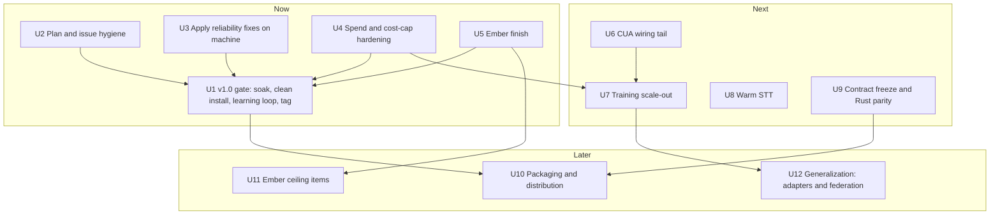

# Wisp Full Roadmap - Plan

## Goal Capsule

- **Objective:** Wisp is a voice assistant the owner trusts on their own desktop every day: it routes correctly, acts on the screen without surprises, costs a known and capped amount, stays up when a local model dies, and installs on a clean Omarchy box in under ten minutes, which is what `v1.0.0` certifies.
- **Authority hierarchy:** user instructions > this plan's Requirements > `ROADMAP.md` v1.0 gate checklist > `docs/plans/2026-10-04-0100-feat-wisp-unified-plan.md` (owner of the W-IDs W1 to W34) > the child plans named in each unit > `AGENTS.md` spend and repo rules.
- **Execution profile:** program-level plan, 12 units across Now, Next and Later. Units here do not re-plan child work; each points to the child plan or unified-plan W-ID that holds the detail and states what is left, what blocks it, and how it is verified. Child plans keep their own unit IDs.
- **Stop conditions:** stop and ask if (a) any unit would call a paid model outside the rules in KTD1, (b) any unit would edit `/usr/share/omarchy/` or the stash-canonical files under `~/.config/hypr/`, (c) a unit needs a decision listed under Outstanding Questions, or (d) evidence in the Current State table has drifted from `master` since 2026-10-05, in which case re-verify before executing.
- **Who finishes:** `ce-work` agents execute the code units. The owner does the things only a person at this machine can: the soak labelling, the clean-VM install, applying machine units, the live multi-theme pass, README recordings, and the four open decisions.

---

## Product Contract

### Summary

Wisp has shipped almost everything the unified plan promised: the staged pipeline, one StateBus, the Ember surfaces, the CUA subsystem with its safety layer, the spend ledger, and the oomd-safe unit templates. What remains is small in code and large in proof. This plan orders the remainder so the `v1.0.0` gate (soak, clean install, learning loop, tag) is reachable, the last Ember gaps close, the machine actually runs the reliability fixes the repo already contains, and the deferred workstreams (STT, contract freeze, parallel training, packaging) have a place and an order.

### Problem Frame

Three things make the picture hard to read. First, plan status has drifted: the unified plan's header still lists W30 and W33 as open although #102, #103 and #101 merged them, and four older plans still read as active. Second, repo-complete and machine-complete are different: the repo ships `scripts/units/*.service` with `Slice=session.slice`, but the live `~/.config/systemd/user/llama-*.service` units on this machine are still in `app.slice` with `ManagedOOMPreference=none`, so the 2026-10-03 oomd kill pattern can recur. Third, the gate that decides `v1.0.0` is mostly measurement by a person (0 of 50 labelled runs per route), which no amount of code removes. The plan separates what an agent can finish from what waits on the owner.

### Current State (verified 2026-10-05)

Evidence is `master` at `67b520c`, `gh pr list --state merged`, the open PR and issue lists, and file checks in the worktree. There are no open PRs. Open issues are #6 (Rust parity core), #17 (packaging and v1.0.0) and #18 (management GUI, effectively delivered by W26 and W28).

| Area | State | Evidence |
|---|---|---|
| Pipeline | done | #102/#103 (W30): `wisp/stage_{capture,route,execute,speak,ctx}.py`, `wisp/bgwriter.py`, `docs/PIPELINE_STAGES.md` |
| Backend core | done except STT and contract freeze | backend plan units landed as #59, #62 to #66, #70, W2 to W16; open: W12 warm STT, W31 freeze |
| Ember UI | 17 of 20 units done | Status Ledger in `docs/plans/2026-10-02-2315-feat-wisp-ember-redesign-plan.md` |
| Gauntlet v2 and training arena | done | #60, W32; `wisp/judge.py`, `wisp/oracle` tests, `scripts/clicklab/{arena,arena_policy,synthesize,cube}.py`; CubeVM run and task synthesizer in `73cb5e3`, `385f5f9` |
| CUA | subsystem done, wiring tail open | #73, #79, #81, #85 (W8 to W10, W13); `docs/CUA.md`; child plan `docs/plans/2026-10-04-1800-feat-cua-driver-and-parallel-training-plan.md` Track A tail and Track B |
| Spend ledger | done | W14 `7ec4236`: `wisp/ledger.py`, `usage.jsonl`, `wispd spend`; `[budget]` keys `daily_usd`, `monthly_usd`, `gate_primary`; `[brain] daily_cap_usd` is deprecated and warns at startup |
| Backend reliability, repo side | done | #90 (W29): `scripts/units/*.service` with `Slice=session.slice`, `ManagedOOMPreference=omit`, start-limit backoff; `wisp/svc.py` watchdog; `wispd doctor` service rows; #65 brain fallback chain; #92 Jev deadline with heuristic fallback |
| Backend reliability, machine side | not applied | `systemctl --user show llama-local llama-jev`: `Slice=app.slice`, `ManagedOOMPreference=none`, units inactive; `wisp-backend` and `wisp-backend-watch.service` live outside the repo (`~/bin`) |
| Packaging | partial | `v0.9.0` released for five platforms (#31); `.github/workflows/release.yml`; desktop entry (#95); tray item not shipped; marketplace verify request and `v1.0.0` tag not done |
| v1.0 gate | not started | `ROADMAP.md`: 0 of 50 labelled runs per route; no clean-VM install timing; learning loop 0 of 2 cycles |
| CI | green on master | `.github/workflows/test.yml` (unittest on ubuntu 3.11 and 3.13, macOS 3.13; Rust build and test), #86 |

### Requirements

**Release readiness**

- R1. `v1.0.0` is tagged only when the four `ROADMAP.md` gate boxes carry their named evidence: the per-route soak table (n at least 50, match at least 0.50 on launch, tool, agent, act, answer), the clean-VM install time under ten minutes with `wispd doctor` exiting 0, two learning cycles with clarify rate before and after, and a green release workflow for all five archives.
- R2. Plan and issue state matches `master`: no plan header claims an open unit that merged, and every open issue maps to a unit here or is closed with a reason.

**Reliability and cost**

- R3. A killed or unreachable local model never leaves Wisp silent: the turn falls back (brain chain, Jev heuristic), the user sees a typed error, and the llama services restart without exhausting their start limit.
- R4. The machine runs what the repo ships: live llama and wispd units are the W29 templates, verified by `wispd doctor`, not by assumption.
- R5. Paid spend is capped and attributable: one ledger, `[budget]` caps fail closed for paid fallbacks, eval and arena spend flows only through the `orch` wrapper, and tests spend nothing.

**Capability**

- R6. Computer use is a measured subsystem: every pointer backend sits behind the registry and safety layer, trajectories are recorded, and training scale-out produces scored records rather than silent zero-record runs.
- R7. STT latency and accuracy are decided by a benchmark rather than by habit (W12), and the decision is recorded.
- R8. The IPC contract is frozen at a version the Rust core can follow, with unsupported surfaces marked `py-only` (W31).
- R9. The Ember surfaces meet the quality bar the Ember plan set: motion modes work, the pointer feed spawns no processes, earcons exist, and perf and contrast are measured.

**Distribution**

- R10. A new user on Omarchy installs from `docs/INSTALL.md` alone; other platforms stay supported at their documented level and are not promised more.

### Scope Boundaries

- No new feature work is accepted into `v1.0.0` beyond the units below; the `ROADMAP.md` cut list stands (wake word, new tools and adapter polish wait).
- No Anthropic or other premium-priced model is used by default anywhere in code, config, tests or eval runs.
- `/usr/share/omarchy/` and the stash-canonical `~/.config/hypr/*.lua` files are not edited by repo code or by agents.

#### Deferred to Follow-Up Work

- Ember "supreme ceiling" items from the Ember plan: console morph, edge docking, multi-monitor ghost hand-off, panel "Ask" field, per-theme earcon timbre (U11 here collects them).
- Wake word, multi-profile support, signed macOS bundle, Windows parity beyond the documented level.
- Replacing the shell-owned `wisp-backend` toggle with an in-repo command (U3 decides whether to adopt it).

### Success Criteria

- Every Now unit has merged evidence and the v1.0 gate boxes are ticked with their evidence in the release notes.
- `wispd doctor` on this machine reports llama units outside `app.slice` and a healthy fallback path.
- A cold search of `docs/plans/` and `ROADMAP.md` leads to this plan first, and each child plan's header points back to it.

### Outstanding Questions

#### Resolve before the dependent unit

- OQ1 (blocks U8). STT engine: warm whisper.cpp, Parakeet, or a hosted provider behind the existing `[stt] provider` seam? The W12 benchmark produces the numbers; the owner decides.
- OQ2 (blocks U9). Rust parity scope: keep `rs/wispd` at full parity, or freeze it to the minimal contract subset and mark the rest `py-only`?
- OQ3 (blocks U9). Is a premium handoff route wanted at all? The default answer under `AGENTS.md` is no.

#### Deferred to implementation

- OQ4. Whether U3's machine-side verification should live in `wispd doctor` only or also gate `wispd install --units`.
- OQ5. Alias period for old CLI command names (W19 question 4); defaults to dropping them at `v1.0.0`.

### Assumptions

- The owner keeps using Wisp daily during the soak; labelling is the only thing that moves the gate.
- `master` stays the integration branch and every unit lands as its own PR with CI green.
- The owner's local machine facts in `~/.claude/CLAUDE.md` (llama services on :8080/:8091/:8081, shim on :8931, `wisp-backend` toggle, oomd on `app.slice`) describe the machine as of 2026-10-05.

---

## Planning Contract

### Key Technical Decisions

- KTD1. **One spend policy for every unit.** Local models are the default (brain on :8080, Jev on :8091, UI-TARS on :8081, Ollama on :11434). OpenRouter is a fallback or batch lane only. Grok 4.7 at roughly $1.60 and $4.80 per Mtok is the price ceiling for any ad-hoc, review or eval call. All eval spend (orchestral evals, Argus captures, portfolio fixture refresh, arena and clicklab model runs, CubeVM runs) bills the dedicated `orchestral-eval-v3` key through the `orch` wrapper, never `openrouter/default`; the arena gate in `scripts/clicklab/arena_policy.py` enforces this with `--via-orch`. Unit tests use the W5 fakes and spend nothing.
- KTD2. **This plan orders; it does not duplicate.** Detail stays in the unified plan (W-IDs), the Ember plan (U-IDs) and the CUA plan (A and B tracks). A unit here owns only status, dependencies, blockers and verification for its workstream. When a child plan and this plan disagree, the child plan's body is stale and this plan's Current State table wins until the child is refreshed.
- KTD3. **Repo-complete is not machine-complete.** Any reliability fix that installs files into `~/.config/` is verified on the machine by an observable (`systemctl --user show`, `wispd doctor`), not by the merge. U3 exists for this reason.
- KTD4. **The v1.0 gate is a measurement milestone.** Units that add features are sequenced after, or alongside without delaying, U1. The only metric that ships `v1.0.0` is the labelled success rate (carried from `ROADMAP.md`).
- KTD5. **Move llama services out of oomd's reach by slice, not by exemption alone.** `app.slice` has `ManagedOOMMemoryPressure=kill` through `~/.config/systemd/user/app.slice.d/10-oomd.conf`; the W29 templates run the llama units in `session.slice` and add `ManagedOOMPreference=omit` as defence in depth. The slice change is the fix; the preference is a backstop. `Restart=on-failure` with `RestartSteps` backoff and a 30 per 900 s start limit stops a kill loop from landing the unit dead.
- KTD6. **Backend toggle stays machine-owned until it earns a repo home.** `~/bin/wisp-backend local|openrouter|status` and `wisp-backend-watch.service` flip wispd between local llama and OpenRouter. The repo already carries the in-process counterpart (brain fallback chain, health codes, Jev deadline). U3 documents the contract between the two so they cannot fight, and decides in OQ4 whether the repo adopts the toggle.
- KTD7. **Plan hygiene is a unit, not a chore.** Status drift is what hid the real state; U2 is small, early and cheap.

### High-Level Technical Design

Workstreams by horizon and the dependencies that actually bind.

U1 is the critical path and is mostly the owner's time. U2 to U5 are the agent-executable work that makes the soak trustworthy (a soak on a Wisp that goes silent when oomd fires measures oomd, not routing). U8 is drawn before U1 because warm STT is the first failure mode `ROADMAP.md` expects the soak to surface; if the soak starts first, U8 simply lands as the "fix the top failure mode weekly" step.

### Sequencing Notes

- Start the soak (U1's labelling) immediately; it is calendar-bound and nothing blocks it.
- U3 first among the code units: it is a single owner action plus a `wispd doctor` check, and it removes the biggest cause of invalid soak data.
- U2 and U4 are documentation and config work and can run in parallel with everything.
- U6 and U7 share `scripts/clicklab/` and the CUA plan; serialise their PRs per the unified plan's collision rules (one PR at a time through `wisp/config.py`).

### System-Wide Impact

- **Config:** U4 and U8 touch `wisp/config.py`; one at a time. Any new key lands with `docs/CONFIG.md` and the settings schema in the same PR, because `tests/test_docs_lint.py` fails on undocumented keys.
- **IPC:** U9 freezes `contract_version`; every additive field after that bumps the minor.
- **Machine:** U3 restarts live services; do it when no turn is in flight and the user is told.

### Risks

| Risk | Mitigation |
|---|---|
| The soak never reaches 50 labelled runs per route | Lower the effort per label (panel buttons, `wispd label`), report the per-route count weekly in U1, and cut routes from the gate only by explicit owner decision |
| A reliability fix lands in the repo but oomd still kills the llamas | U3 checks the slice on the running process (`systemctl --user show`, `cat /proc/<pid>/cgroup`), not the unit file |
| Fallback to OpenRouter spends silently | KTD1 plus U4: paid fallbacks stop at the cap, and the ledger row is asserted in a replay-harness test |
| Hammer or arena runs produce zero records (seen 2026-10-05) | U7 adds a non-zero-records assertion and a loud failure when every run is refused at the gate |
| Status drift returns | U2 adds a check that fails when a plan header names a unit as open that `ROADMAP.md` lists as done, or documents the manual step if that proves too brittle |

### Sources

- `ROADMAP.md`, `README.md`, `AGENTS.md`, `docs/PIPELINE_STAGES.md`, `docs/LINUX.md`, `docs/CUA.md`.
- `docs/plans/2026-10-04-0100-feat-wisp-unified-plan.md` (W-IDs, crosswalk, collision rules).
- `docs/plans/2026-10-02-2315-feat-wisp-ember-redesign-plan.md` (Status Ledger).
- `docs/plans/2026-10-03-1455-feat-wisp-backend-core-plan.md`, `docs/plans/2026-10-03-002-feat-gauntlet-v2-plan.md`, `docs/plans/2026-10-04-1800-feat-cua-driver-and-parallel-training-plan.md`.
- `gh pr list -R duketopceo/wisp --state merged` and the open issue list, 2026-10-05.

---

## Implementation Units

### Unit Index

| U-ID | Horizon | Title | Child plan or W-ID | Depends on |
|---|---|---|---|---|
| U1 | Now | v1.0 gate: soak, clean install, learning loop, tag | unified W34, `ROADMAP.md` | U2, U3, U4, U5 (soak starts now) |
| U2 | Now | Plan, issue and doc hygiene | unified W33 tail | none |
| U3 | Now | Apply and verify reliability fixes on the machine | unified W29, KTD5, KTD6 | none |
| U4 | Now | Spend ledger and cost-cap hardening | unified W14, W15 | none |
| U5 | Now | Ember UI finish | Ember plan U2 gap, U5 gap, U8, U13, U20 | none |
| U6 | Next | CUA wiring tail | CUA plan Track A (A1 to A6) | U4 |
| U7 | Next | Training scale-out and gauntlet follow-through | CUA plan Track B, gauntlet v2 | U4, U6 |
| U8 | Next | Warm STT | unified W12 | OQ1 |
| U9 | Next | Contract freeze and Rust parity decision | unified W31, issue #6 | OQ2 |
| U10 | Later | Packaging and distribution | issue #17, `release.yml`, unified W27 | U1, U9 |
| U11 | Later | Ember ceiling items | Ember plan Deferred list | U5 |
| U12 | Later | Generalization: adapters and federation | CUA plan Out of scope and Next | U7 |

### U1. v1.0 gate: soak, clean install, learning loop, tag

- **Goal:** `v1.0.0` exists with release notes that carry the gate evidence.
- **Requirements:** R1, R10.
- **Status:** not started. `ROADMAP.md` records 0 of 50 labelled runs per route, no timed clean-VM install and 0 of 2 learning cycles. Tooling exists: `wispd label`, `wispd learn`, `wispd trace digest`, `wispd onboard`, `wispd doctor`.
- **Dependencies:** none to begin the soak; the tag needs U2 to U5 done or consciously waived. U8 (warm STT) is a possible remediation if the soak identifies STT as the top failure mode, not a prerequisite.
- **Files:** modify `ROADMAP.md` (tick boxes with evidence), release notes in the GitHub release; no code unless the soak surfaces a defect, which becomes its own unit.
- **Approach:**
  1. Owner labels every run for the soak window; weekly, read the per-route table, fix the top failure mode, re-measure.
  2. Owner runs the clean-VM install with a stopwatch following `docs/INSTALL.md` only.
  3. Owner runs two learning cycles a week apart and records clarify rate before and after.
  4. When all three boxes carry evidence and the gate set is green, tag `v1.0.0` and file the Omarchy marketplace verify request.
- **Test scenarios:** Test expectation: none -- measurement and release; the gate set below is the test.
- **Verification:** the gate set is green (`python -m unittest discover -s tests`, `python scripts/ui/snap.py check`, `python scripts/assets/gen_copy.py --check`, `python scripts/assets/gen_settings.py --check`) and the release workflow builds all five archives.

### U2. Plan, issue and doc hygiene

- **Goal:** the repo's planning surface says what is true.
- **Requirements:** R2.
- **Status:** not started. Known drift: the unified plan header says `active (open: W12, W30, W31, W33, W34)` and its table lists W30 and W33 as in progress, but #102/#103 and #101 merged them; `ROADMAP.md` still says "Still open: W12 warm STT, W30 pipeline refactor, W31 contract freeze"; `docs/plans/2026-09-30-001-feat-wisp-proactive-companion-plan.md` and the CUA plan carry `status: draft`; issues #17 and #18 are open although their work merged.
- **Dependencies:** none.
- **Files:** modify `docs/plans/2026-10-04-0100-feat-wisp-unified-plan.md` (header and the W30 and W33 rows with merge evidence), `ROADMAP.md` (the "Still open" sentence), `docs/plans/2026-10-04-1800-feat-cua-driver-and-parallel-training-plan.md` (pointer to this plan); issue comments or closure for #17, #18, #6 with a link to the unit that owns each.
- **Approach:** update rows from `git log` and merged PR evidence only; do not close an issue whose work is not done (#17 stays open until U1 tags; #6 stays open until U9 decides); point the child plan headers at `docs/plans/2026-10-05-001-feat-wisp-full-roadmap-plan.md`.
- **Test scenarios:** `python -m unittest tests.test_docs_lint` still passes after the `ROADMAP.md` edit; a grep for "W30" and "W33" in the unified plan shows done with evidence.
- **Verification:** doc-lint test; a reviewer can follow every status claim to a PR or commit.

### U3. Apply and verify reliability fixes on the machine

- **Goal:** the llama services survive memory pressure and the backend fallback path is exercised, on this machine.
- **Requirements:** R3, R4.
- **Status:** repo side done (#90, W29). Machine side not applied: live units are `Slice=app.slice`, `ManagedOOMPreference=none`, and currently inactive.
- **Dependencies:** none.
- **Files:** no repo change expected. Machine: `~/.config/systemd/user/llama-{local,jev,uitars}.service`, `jev-shim.service`, `wispd.service` from `scripts/units/` via `wispd install --units`. Repo: optionally `docs/LINUX.md` (add the verification commands) and `wisp/cli/diagnose.py` if `wispd doctor` does not yet flag a llama unit still in `app.slice`.
- **Approach:**
  1. Preview with `wispd install --units --dry-run`, then install (the installer backs up first and is idempotent).
  2. `systemctl --user daemon-reload`, then restart each unit when no turn is in flight; confirm with `systemctl --user show -p Slice,ManagedOOMPreference <unit>` and the main PID's cgroup.
  3. Confirm `wisp-backend status` and `wisp-backend-watch.service` agree with the in-process chain: watch fallback to OpenRouter when :8080 is stopped, return to local after about 60 s healthy, and check that the `usage.jsonl` row for the fallback turn lands in the ledger.
  4. Record the contract between the toggle and the in-process chain in `docs/LINUX.md` (who flips what, and which wins) so the two cannot fight (KTD6).
- **Test scenarios:**
  - `wispd doctor` exits 0 and shows each llama unit outside `app.slice`.
  - Under induced pressure (a bounded allocation test run by the owner, never in CI), `systemd-oomd` does not select the llama units; `journalctl --user -u systemd-oomd` shows no kill of them.
  - Stopping :8080 yields a typed health error, a brain fallback to OpenRouter within the watch's 60 s window, and a ledger row; restarting it returns to local.
  - If a doctor check is added: a unit fixture in `app.slice` makes it fail (extend `tests/test_svc.py`).
- **Verification:** the observables above, pasted into the PR or a comment; no paid call beyond one short fallback turn billed through the ledger, and none from tests.

### U4. Spend ledger and cost-cap hardening

- **Goal:** spend is capped, attributable, and the config surface matches the code.
- **Requirements:** R5.
- **Status:** ledger done (W14, W15). Gaps found: the deprecated `[brain] daily_cap_usd` still exists on disk configs and warns at startup (the CUA plan status note shows `[budget] daily_usd = 1` already set in the owner's config); `daily_usd` is commented out in the generated config so the default of 8.00 applies silently; the 2026-10-05 hammer window produced zero records because the arena refused every run without the `orch` marker, and nothing surfaced it.
- **Dependencies:** none.
- **Files:** modify `wisp/config.py` and `docs/CONFIG.md` (migration note for the deprecated key, explicit default text), `wisp/cli/diagnose.py` (`wispd doctor` row: effective daily and monthly cap, deprecated-key warning, whether the `orch` key resolves), `scripts/clicklab/arena.py` and `scripts/clicklab/arena_policy.py` (exit non-zero with one line when every run in a batch was refused), `tests/test_ledger.py`, `tests/test_arena.py`.
- **Approach:**
  1. Surface the effective caps and the deprecated key in `wispd doctor`; keep the single policy: paid fallbacks stop at the cap, the primary continues unless `[budget] gate_primary` is set.
  2. Make a batch with zero accepted runs a loud failure naming the missing `--via-orch` marker.
  3. Document the rule in `docs/CONFIG.md`: eval spend bills only the orchestral key through `orch`; nothing in tests or default config names a premium model.
- **Test scenarios:**
  - A config with the deprecated key resolves to the same cap as `[budget] daily_usd` and `wispd doctor` warns once.
  - A paid fallback call over the cap is refused (fail closed) and the refusal is recorded; a local call over the cap proceeds.
  - An arena batch where every run is refused exits non-zero and prints the cause.
  - A default-config test asserts no Anthropic or premium model id appears in shipped defaults.
- **Verification:** `python -m unittest discover -s tests`; `wispd spend` shows the same totals as `usage.jsonl`.

### U5. Ember UI finish

- **Goal:** the remaining Ember gaps close and the redesign is measured against its quality bar.
- **Requirements:** R9.
- **Status:** 17 of 20 Ember units done; open: U2 motion wiring, U5 `wispd replay`, U8 earcons, U13 fork-free pointer and rider, U20 recordings and measurement. Full table and unit text in `docs/plans/2026-10-02-2315-feat-wisp-ember-redesign-plan.md`. The original blocker (the owner's uncommitted `Companion.qml` and `run.py` work) cleared when #60 merged.
- **Dependencies:** none; order inside the unit is U2 gap and U5 gap, then U8 and U13, then U20.
- **Files:** per the Ember plan: `wisp/config.py`, `wisp/settings_schema.py`, `wisp/cli/replay.py`, `shell-plugin/WispService.qml`, `shell-plugin/Companion.qml`, `shell-plugin/components/{CursorFeed,Earcons,Creature,OverlayLayer}.qml`, `scripts/assets/make_earcons.py`, `assets/sound/`.
- **Approach:** execute the Ember plan's open units as four small PRs (motion wiring; replay; earcons; pointer feed and rider), then the QA pass. The live multi-theme step is the owner's.
- **Test scenarios:** per Ember plan unit; the cross-cutting ones are zero `hyprctl` forks during a replayed acting turn and motion modes changing the creature within one second.
- **Verification:** snapshot check and QML lib tests on a machine with the Qt runner (the `snap.py check` run in this environment skipped because the runner or PIL was missing), plus the measurement record in the U20 PR.

### U6. CUA wiring tail

- **Goal:** the cua-driver subsystem is fully wired into the tools and the ghost cursor, with trajectories recorded.
- **Requirements:** R6.
- **Status:** subsystem done (pointer registry #73, safety layer #79, health and installer #81, grounding chain #85, `docs/CUA.md`). Open per the CUA plan: A1 typed client completion, A2 pointer correctness cleanup, A3 desktop-state screenshots, A4 agent cursor as ghost cursor, A5 trajectory recording in clicklab, A6 `browser_*` eval (deferred decision). The research swarm (A0) is done; reports are under `docs/research/cua-*.md`.
- **Dependencies:** U4 (spend attribution for any model-grounded step).
- **Files:** per the CUA plan: `wisp/cua.py`, `wisp/pointer.py`, `wisp/tools/system.py`, the Companion bridge in `shell-plugin/`, `scripts/clicklab/run.py`.
- **Approach:** follow the CUA plan's A1 to A5 in order, one PR each; settle A6 with the owner before building. Keep every action behind `wisp/cua_safety.py` (deny/allow, rate limits, kill switch, dry-run, audit).
- **Test scenarios:** the plan's own; plus a safety regression: a denied action never reaches the driver, and the kill switch stops an in-flight sequence (existing `tests/test_cua_safety.py` extended).
- **Verification:** unit tests with the cua fakes (no live driver in CI); one live trajectory recorded and replayed locally.

### U7. Training scale-out and gauntlet follow-through

- **Goal:** training produces scored, attributable records in parallel, locally and in CubeVM, without surprise spend.
- **Requirements:** R5, R6.
- **Status:** gauntlet v2 done (judge, oracle, first-fault, pass^k, flake taxonomy, reviewer: #60, W32). CubeVM worker and task synthesizer landed (`73cb5e3`, `385f5f9`; 8 of 8 generated tasks verified in a MicroVM). Open per the CUA plan Track B: B1 parallel-safe clicklab, B2 `hammer-parallel.sh`, B3 aggregation and per-model report, B4 CubeVM arena at scale; then Tier-1 site adapters and recipe auto-promotion.
- **Dependencies:** U4 (zero-record failure loud), U6 (trajectory recording).
- **Files:** `scripts/clicklab/{run.py,cube.py,synthesize.py,arena.py}`, a new `scripts/clicklab/hammer-parallel.sh`, `docs/research/cube-parallel-arena.md` as input.
- **Approach:** fix B1 first (it is a prerequisite bug); then parallel local, then CubeVM; every model call routes through `orch` and `arena_policy`, results aggregate per model and suite, and recipe promotion stays human-gated (`wispd recipes approve`).
- **Test scenarios:** two parallel workers never share a profile or port; an aggregation over a fixture result set is deterministic; a run whose every task is refused fails loudly; spend per batch is bounded by the daily cap (ledger assertion with a stubbed price table).
- **Verification:** local fake-model run in CI; one live bounded run billed to the orchestral key, with the `usage.jsonl` delta recorded.

### U8. Warm STT

- **Goal:** key-to-transcript latency drops and accuracy is measured, with the engine chosen on evidence.
- **Requirements:** R7.
- **Status:** not started (W12). Baseline from the unified plan: key to transcript 2.75 s p50 and 4.2 s p90 with cold whisper; `docs/baselines/latency-harness.json` marks `needs_live_baseline`.
- **Dependencies:** OQ1 (owner decision after the benchmark).
- **Files:** create `wisp/stt.py` (engine seam), benchmark script under `scripts/`, tests with fixture WAVs from `scripts/make_fixture_wavs.py`; modify `wisp/stage_capture.py`, `wisp/config.py` (`[stt]` keys), `docs/CONFIG.md`, `docs/baselines/latency-harness.json`.
- **Approach:** benchmark warm whisper.cpp, Parakeet and the hosted option on the fixture corpus plus the owner's real recordings (local only); pick one; implement a resident engine with a model-warm health row; keep the hosted provider as an opt-in fallback behind the ledger.
- **Test scenarios:** engine seam returns identical `Transcript` shapes across fakes; a cold start falls back and is logged; p50 and p90 are computed by the existing `wispd latency` harness from real traces.
- **Verification:** before and after latency table from real traces; no paid STT call in tests.

### U9. Contract freeze and Rust parity decision

- **Goal:** the IPC contract has a frozen version and the Rust core's scope is explicit.
- **Requirements:** R8.
- **Status:** partial (W31). `contract_version` 1 and `tests/test_contract.py` exist; the freeze and `py-only` marks are not done. Issue #6 is open.
- **Dependencies:** OQ2.
- **Files:** `docs/IPC_CONTRACT.md`, `wisp/state.py`, `rs/wispd/`, `tests/test_contract.py`.
- **Approach:** decide scope (OQ2); mark every command and field `shared` or `py-only`; make the Rust core pass the shared-subset golden tests; document the version bump rule.
- **Test scenarios:** a contract test fails when a Python field is neither implemented in Rust nor marked `py-only`; the Rust build and test job passes on ubuntu and macOS.
- **Verification:** CI `rust` job green; contract doc and tests agree.

### U10. Packaging and distribution

- **Goal:** distribution beyond the owner's machine is real and honest about its limits.
- **Requirements:** R10.
- **Status:** `v0.9.0` published for five platforms; desktop entry shipped (#95); no tray item; marketplace listing not requested; `v1.0.0` is U1.
- **Dependencies:** U1, U9.
- **Files:** `.github/workflows/release.yml`, `docs/INSTALL.md`, `docs/MACOS.md`, `docs/WINDOWS.md`, `scripts/units/`, tray item if pursued.
- **Approach:** after the tag: marketplace verify request, a tray item where the host supports SNI, checksum and provenance for release archives, and a documented support level per platform; macOS menu-bar and signing wait for demand.
- **Test scenarios:** the release workflow's archive smoke test runs the binary's `--version` and `doctor` on each platform; install docs are followed in the U1 VM run.
- **Verification:** published release with checksums; marketplace request filed.

### U11. Ember ceiling items

- **Goal:** the deferred polish that makes Wisp feel finished, only if the soak says the basics are solid.
- **Requirements:** R9 (beyond the bar).
- **Status:** deferred. Items from the Ember plan: console morph from the creature, origin-aware pill entrance, edge docking, multi-monitor ghost hand-off and lead behavior, beacon sequence paths, panel "Ask" field, live 14 px bar creature, animated icon transitions, per-theme earcon timbre, opt-in mascot accessories, hiding overlays from screen captures.
- **Dependencies:** U5.
- **Files:** `shell-plugin/components/*`, `assets/`.
- **Approach:** pick items by soak feedback; each gets its own small plan before work. No paid APIs, no generated imagery.
- **Test scenarios:** per item, with offscreen snapshots on two themes.
- **Verification:** the Ember plan's verification contract.

### U12. Generalization: adapters and federation

- **Goal:** the task-and-oracle synthesizer and recipes reach apps beyond the browser fixtures.
- **Requirements:** R6.
- **Status:** seed exists (`scripts/clicklab/synthesize.py`). Next per the CUA plan: Tier-1 site adapters (X post, YouTube analytics, Linear project), one Tier-2 off-browser adapter (Godot or OBS scripting API as the app's own `__score`), recipe auto-promotion, federation plumbing.
- **Dependencies:** U7.
- **Files:** `scripts/clicklab/`, `wisp/skills`-related modules, new adapter directory decided in the unit's own plan.
- **Approach:** write a child plan when U7 is done; keep human gating on recipe promotion and the spend rules of KTD1.
- **Test scenarios:** defined in the child plan.
- **Verification:** defined in the child plan.

---

## Verification Contract

| Gate | Command or method | Applies to |
|---|---|---|
| Python unit tests (CI) | `python -m unittest discover -s tests -v` | every code unit |
| Compile check (CI) | `python -m py_compile wispd wisp/*.py wisp/tools/*.py scripts/propose_criteria.py tests/*.py` | every code unit |
| Rust build and test (CI) | `cargo build --locked && cargo test` in `rs/wispd` | U9 |
| Doc lint | `python -m unittest tests.test_docs_lint` (README, ROADMAP and `docs/*.md` name only real commands and config keys) | U2, U4, U5, U8 |
| Copy and settings generators | `python scripts/assets/gen_copy.py --check`, `python scripts/assets/gen_settings.py --check` | U4, U5, U8 |
| UI snapshots (local, needs Qt runner and Pillow) | `python scripts/ui/snap.py check` | U5, U11 |
| QML lib tests (local) | `/usr/lib/qt6/bin/qmltestrunner -input tests/qml/lib` | U5 |
| Machine observables (owner machine) | `systemctl --user show -p Slice,ManagedOOMPreference <unit>`, `wispd doctor`, `wisp-backend status` | U3 |
| Spend check | `wispd spend`, `usage.jsonl` delta around any live paid call; tests use fakes only | U4, U6, U7, U8 |
| Release gate | `ROADMAP.md` checklist evidence plus a green release workflow | U1, U10 |

No gate in this table calls a paid model. Live runs that do are named in the unit, billed through `orch`, and bounded by the daily cap.

## Definition of Done

- Every unit has merged evidence (PR or commit) or an explicit owner-waiver recorded in this plan's revision history through git.
- U1's four gate boxes are ticked in `ROADMAP.md` with evidence and `v1.0.0` is tagged.
- `ROADMAP.md` lists this plan first and the child plans after it, and each child plan's header points to this plan.
- No plan header or `ROADMAP.md` sentence names a merged unit as open.
- `wispd doctor` on the owner's machine shows the llama units outside `app.slice`.
- No premium model id, no `openrouter/default` eval spend, and no paid call from tests exist in the tree.
- Abandoned experiment code from any unit (alternate shaders, unused adapters, dead scripts) is removed from the final diff.
